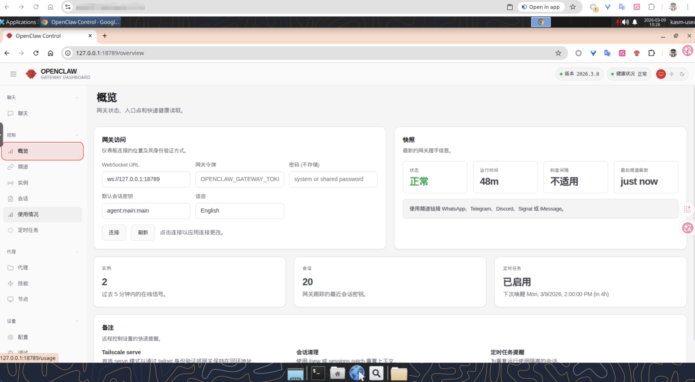

<div align="center">
  <h1>Agent Workspace</h1>
  <p>AI 智能体云桌面开发与运行环境</p>
  <p>
    <a href="README.md">中文</a> &bull;
    <a href="README_en.md">English</a>
  </p>
</div>

---

基于 [LinuxServer Webtop](https://docs.linuxserver.io/images/docker-webtop/)（Selkies WebRTC）的容器化云桌面，为 AI 智能体（OpenClaw、Openfang 等）提供安全隔离的开发与运行环境。



## 核心特性

- **Selkies WebRTC 桌面** — 通过浏览器访问完整 Linux 桌面（HTTPS），支持 Wayland、自适应分辨率、[动态 HiDPI 缩放](docs/hidpi-scaling.md)
- **三种桌面环境** — LXQt（轻量 ~300MB）/ XFCE（中等 ~800MB）/ KDE（完整 ~1.1GB）
- **完整开发工具链** — Node.js 22、Go 1.22、Rust、Python 3、Homebrew、uv
- **多种 Docker 模式** — 不启用 / DinD（容器内独立 Docker）/ 挂载宿主机 Docker
- **GPU 加速** — 自动检测 NVIDIA / Intel / AMD GPU，支持硬件渲染与编码
- **国内镜像加速** — 运行时通过 `USE_CHINA_MIRROR=true` 一键切换全套国内源（APT、npm、pip、Go、Rust、Homebrew）
- **数据持久化** — 基于 LinuxServer `/config` 标准挂载，所有工具配置、包缓存、用户数据持久化
- **systemctl 进程管理** — 通过 docker-systemctl-replacement 管理 Agent 进程

## 快速开始

### 一键安装（推荐）

交互式脚本自动引导完成 9 步配置（语言、桌面、Docker、镜像源、版本、数据目录、端口、Agent 软件、Agent 端口）：

**Linux / macOS**
```bash
# 国内用户（GitCode 镜像）
curl -fsSL https://raw.gitcode.com/fliaping0/agent-workspace/raw/main/install.sh | bash

# 国际用户（GitHub）
curl -fsSL https://raw.githubusercontent.com/fliaping/agent-workspace/main/install.sh | bash
```

**Windows (PowerShell)**
```powershell
# 国内用户（GitCode 镜像）
irm https://raw.gitcode.com/fliaping0/agent-workspace/raw/main/install.ps1 -OutFile install.ps1; .\install.ps1

# 国际用户（GitHub）
irm https://raw.githubusercontent.com/fliaping/agent-workspace/main/install.ps1 -OutFile install.ps1; .\install.ps1
```

### Docker 命令启动

```bash
docker run -d --name agent-workspace \
  --restart unless-stopped --shm-size 2gb \
  -e PUID=1000 -e PGID=1000 \
  -e TZ=Asia/Shanghai \
  -e LC_ALL=zh_CN.UTF-8 \
  -e SELKIES_ENABLE_WAYLAND=true \
  -e PIXELFLUX_WAYLAND=false \
  -p 3001:3001 \
  -v ~/agent-workspace-data:/config \
  xuping/agent-workspace:ubuntu-lxqt
```

启动后访问 **https://localhost:3001** 打开桌面。

> 国内用户镜像：`registry.cn-hangzhou.aliyuncs.com/fliaping/agent-workspace:ubuntu-lxqt`

### Docker Compose 启动

```bash
git clone https://github.com/fliaping/agent-workspace.git
cd agent-workspace
# 按需修改 docker-compose.yml
docker compose up -d
```

## 镜像标签

| 标签 | 说明 |
|------|------|
| `ubuntu-lxqt` | LXQt 桌面（默认，最轻量） |
| `ubuntu-xfce` | XFCE 桌面 |
| `ubuntu-kde` | KDE 桌面 |

## 环境变量

| 变量 | 默认值 | 说明 |
|------|--------|------|
| `PUID` / `PGID` | `1000` | 容器内用户/组 ID |
| `TZ` | `Etc/UTC` | 时区 |
| `LC_ALL` | - | 语言环境（如 `zh_CN.UTF-8`） |
| `SELKIES_ENABLE_WAYLAND` | `true` | 启用 Wayland 显示协议 |
| `PIXELFLUX_WAYLAND` | `false` | 强制 X11 模式（`true` 时 Selkies 无法输入中文） |
| `SELKIES_SCALING_DPI` | 不设置 | DPI 缩放（不设置时 Selkies 自动适配浏览器缩放比例，固定值如 192 适用于始终 HiDPI 场景） |
| `SELKIES_USE_BROWSER_CURSORS` | `true` | CSS 光标，鼠标零延迟 |
| `SELKIES_CONGESTION_CONTROL` | `true` | 网络拥塞控制，自适应码率 |
| `SELKIES_H264_CRF` | `28` | H264 画质（5-50，越大画质越低延迟越低） |
| `SELKIES_JPEG_QUALITY` | `30` | JPEG 回退画质（1-100，默认 40） |
| `SELKIES_H264_STREAMING_MODE` | `true` | H264 流式模式，降低编码延迟 |
| `START_DOCKER` | `false` | 启用容器内 Docker（需 `--privileged`） |
| `USE_CHINA_MIRROR` | `false` | 运行时切换国内镜像源 |
| `SSH_PASSWORD` | 不设置 | 设置后启用 SSH 服务（端口 22），值为 abc 用户密码 |
| `NODE_OPTIONS` | - | Node.js 选项（如 `--max-old-space-size=2048`） |

## Docker 模式

| 模式 | 配置 | 说明 |
|------|------|------|
| 不启用 | 默认 | 无 Docker 功能 |
| DinD | `--privileged` + `START_DOCKER=true` | 容器内独立 Docker 引擎 |
| 挂载宿主机 | `-v /var/run/docker.sock:/var/run/docker.sock` | 共享宿主机 Docker |

## GPU 加速

| GPU 类型 | 配置 |
|----------|------|
| NVIDIA | `--gpus all -e NVIDIA_VISIBLE_DEVICES=all -e NVIDIA_DRIVER_CAPABILITIES=all --device /dev/dri:/dev/dri` |
| Intel/AMD | `--device /dev/dri:/dev/dri -e DRINODE=/dev/dri/renderD128` |

> 安装脚本会自动检测 GPU 并配置。

## 内置工具链

| 工具 | 版本 | 说明 |
|------|------|------|
| Node.js | 22 LTS | + npm、pnpm、TypeScript |
| Go | 1.22.4 | |
| Rust | stable | + Cargo |
| Python 3 | 系统版 | + pip、venv、uv |
| Homebrew | 最新 | Linux 版，持久化到数据目录 |
| docker-systemctl-replacement | 最新 | systemd 替代，管理 Agent 进程 |

## Agent 软件管理

安装脚本支持一键安装以下 Agent 软件：

| Agent | 默认端口 | 安装方式 |
|-------|----------|----------|
| OpenClaw | 18789 | npm |
| Openfang | 4200 | cargo build |
| ZeroClaw | 42617 | brew |

Agent 进程通过 **systemctl** 管理：

```bash
# 查看状态
docker exec agent-workspace systemctl status openclaw

# 查看日志
docker exec agent-workspace journalctl -u openclaw

# 重启服务
docker exec agent-workspace systemctl restart openclaw
```

## 数据持久化

容器 `/config` 目录映射到宿主机数据目录，以下内容持久化：

- Homebrew 软件（`/config/.linuxbrew`，自动软链接到 `/home/linuxbrew/.linuxbrew`）
- npm 全局包（`/config/.npm-global`）
- Go 工作区（`/config/go`）
- Cargo 包（`/config/.cargo`）
- pip/uv 缓存（`/config/.cache`）
- 桌面配置和用户文件

## 自定义构建

```bash
git clone https://github.com/fliaping/agent-workspace.git
cd agent-workspace

# 默认构建（LXQt + 国际源）
docker compose build

# KDE 桌面
DESKTOP=kde docker compose build

# 国内源加速
USE_CHINA_MIRROR=true docker compose build
```

## 常用命令

```bash
# 查看日志
docker logs -f agent-workspace

# 进入容器
docker exec -it agent-workspace bash

# 停止/启动
docker stop agent-workspace
docker start agent-workspace
```

## 注意事项

- Selkies WebRTC 默认无密码认证，公网暴露请配置反向代理和认证
- Homebrew 持久化到 `/config/.linuxbrew`（自动软链接），请勿手动修改 `/home/linuxbrew/.linuxbrew` 路径结构
- 首次启动时 LinuxServer 会自动初始化 `/config` 目录

## 架构支持

| 架构 | Docker 平台 |
|------|------------|
| x86-64 | `linux/amd64` |
| ARM64 | `linux/arm64` |

## 相关链接

- [LinuxServer Webtop 文档](https://docs.linuxserver.io/images/docker-webtop/)
- [Docker Hub](https://hub.docker.com/r/xuping/agent-workspace)
- [GitHub](https://github.com/fliaping/agent-workspace)
