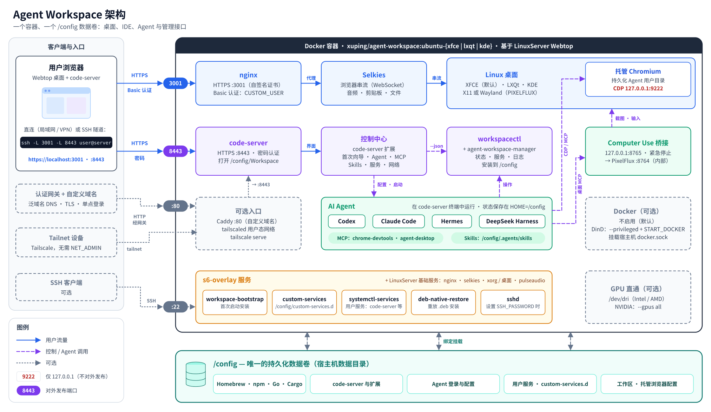
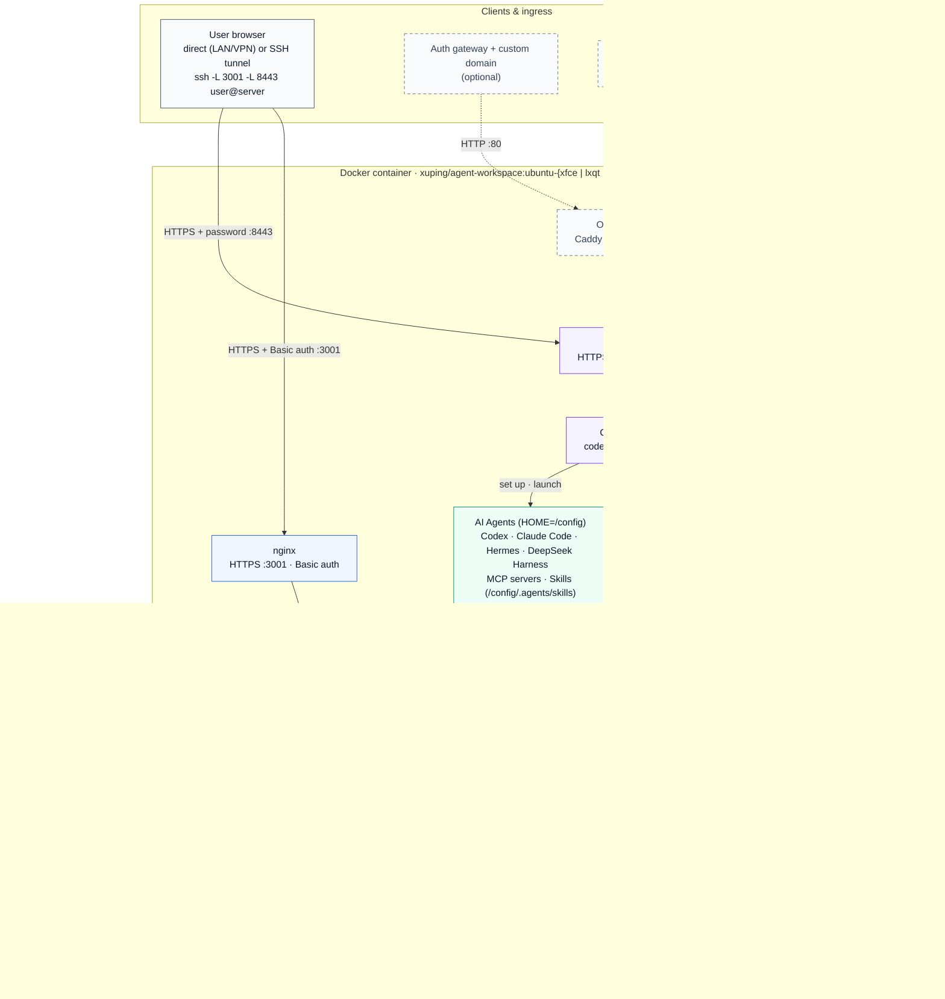

<div align="center">
  <h1>Agent Workspace</h1>
  <p>开箱即用的远程 AI Agent 开发与运行环境</p>
  <p>
    <a href="README.md">中文</a> &bull;
    <a href="README_en.md">English</a>
  </p>
  <p>
    <a href="https://hub.docker.com/r/xuping/agent-workspace"></a>
    <a href="https://hub.docker.com/r/xuping/agent-workspace/tags"></a>
  </p>
</div>

---

基于 [LinuxServer Webtop](https://docs.linuxserver.io/images/docker-webtop/)（Selkies 浏览器桌面串流）的容器化远程工作区。一个 `/config` 数据卷即可持久化桌面、code-server、Agent、MCP、Skills 和自定义服务，适合在服务器、NAS 或 WSL2 上长期运行 Codex、Claude Code、Hermes 等 AI Agent。

## 界面截图

以下截图来自真实运行的 `ubuntu-xfce` 镜像（`remote-up.sh` 部署，点击可查看原图）：

<table>
  <tr>
    <td align="center" width="50%"><a href="images/screenshots/webtop-desktop.png"></a><br><sub>Webtop 桌面（XFCE）</sub></td>
    <td align="center" width="50%"><a href="images/screenshots/code-server-workspace.png"></a><br><sub>code-server 工作区</sub></td>
  </tr>
  <tr>
    <td align="center" width="50%"><a href="images/screenshots/control-center-overview.png"></a><br><sub>控制中心 · 概览与首次向导</sub></td>
    <td align="center" width="50%"><a href="images/screenshots/control-center-agents.png"></a><br><sub>控制中心 · Agent</sub></td>
  </tr>
  <tr>
    <td align="center" width="50%"><a href="images/screenshots/control-center-mcp-skills.png"></a><br><sub>控制中心 · MCP 与 Skills</sub></td>
    <td align="center" width="50%"><a href="images/screenshots/control-center-services.png"></a><br><sub>控制中心 · 服务</sub></td>
  </tr>
  <tr>
    <td align="center" width="50%"><a href="images/screenshots/control-center-network.png"></a><br><sub>控制中心 · 网络</sub></td>
    <td align="center" width="50%"><a href="images/screenshots/control-center-diagnostics.png"></a><br><sub>控制中心 · 诊断</sub></td>
  </tr>
</table>

## 核心特性

- **Agent 开箱即用** — 首次启动可选 Codex、Claude Code、Hermes 或 DeepSeek Harness；Codex 和 Claude Code 会同时安装官方 code-server 扩展
- **统一双语控制中心** — 一处管理 Agent、托管浏览器、全局 MCP 与 Skills、服务、桌面、网络和诊断；中英文切换会同步 code-server
- **Agent 可直接操作环境** — `workspacectl` 提供稳定接口，用于检查服务、日志、端口、路由和可选能力
- **Selkies 浏览器桌面** — 通过 HTTPS 在浏览器中访问完整 Linux 桌面（Selkies 经 WebSocket 串流）；可选 XFCE（默认）、LXQt 或 KDE
- **Agent 托管浏览器** — 桌面默认 Chromium 使用持久化托管用户目录，Agent 可直接操作同一窗口、标签页和登录会话，无需每次确认
- **桌面 Computer Use** — Agent 可截图并操作 Selkies 正在显示的同一个桌面，支持鼠标、键盘、滚动、拖拽、窗口聚焦和紧急停止
- **桌面软件包安装器** — 在文件管理器中双击 `.deb` 即可检查软件包信息、确认风险并自动解析依赖后安装
- **灵活的 Docker 权限边界** — 可关闭 Docker、使用容器内 DinD，或显式挂载宿主机 Docker Socket
- **可选远程网络** — 支持 SSH 隧道、自定义域名 + Caddy 和无需 `NET_ADMIN` 的 Tailscale 自组网
- **完整开发工具链** — Node.js 22、Go 1.22、Rust、Python 3、Homebrew、uv、tmux，并支持 NVIDIA / Intel / AMD GPU 加速
- **单卷持久化** — 工具、登录状态、配置、缓存和自定义服务全部持久化到 `/config`；支持一键切换国内镜像

## 开箱即用范围

下表以推荐的 `remote-up.sh`（`docker-compose.remote.yml`）部署为准。直接 `docker run` 或使用
`docker-compose.yml` 时，若未设置 `AGENT_WORKSPACE_BOOTSTRAP`，默认只启动 Webtop 桌面，详见
[部署方式对比](#部署方式对比)。

| 部分 | 部署后已就绪 | 用户还需要做什么 |
|------|--------------|----------------------|
| 工作区 | Webtop、code-server、Control Center、`workspacectl` | 在浏览器打开访问地址 |
| 首选 Agent | CLI 和对应 IDE 入口 | 完成官方账号登录或 API/模型配置 |
| 日常管理 | Agent、MCP、Skills、服务、桌面、网络和诊断界面 | 按项目需求添加资源或启用服务 |
| 远程访问 | 本地 HTTPS 端点和 SSH 隧道方案 | 按需启用自定义域名、认证网关或 Tailscale |

最短使用路径是：运行 `remote-up.sh` → 打开 code-server → 完成一个 Agent 的登录 → 让该 Agent 继续配置其他功能。

## 架构

<p align="center">
  <a href="images/architecture.zh.svg"></a>
  <br><sub>点击图片查看可缩放的 SVG 版本</sub>
</p>

| 层级 | 组件 | 说明 |
|------|------|------|
| 接入层 | 浏览器、SSH 隧道、可选认证网关 + Caddy、可选 Tailscale | 对外只发布 `3001`（桌面）和 `8443`（code-server）；SSH `22` 与 Caddy `80` 均为可选 |
| 桌面层 | nginx → Selkies → XFCE / LXQt / KDE，托管 Chromium | nginx 提供 HTTPS 与 Basic 认证；Selkies 通过 WebSocket 串流桌面；Chromium 的 CDP 仅监听 `127.0.0.1:9222` |
| IDE / 控制中心层 | code-server、Control Center 扩展、`workspacectl`、`agent-workspace-manager` | code-server 使用密码认证；Control Center 读取 `workspacectl status --json`；manager 把应用层能力安装到 `/config` |
| Agent 层 | Codex、Claude Code、Hermes、DeepSeek Harness，MCP 与 Skills，Computer Use 桥接 | Agent 在 code-server 终端运行，通过 MCP 操作托管浏览器（CDP）和桌面（桥接 `127.0.0.1:8765`） |
| 服务层 | s6-overlay：`workspace-bootstrap`、`custom-services`、`systemctl-services`、`deb-native-restore`、`sshd` | 首次启动安装、注册 `/config/custom-services.d`、启动用户级服务（code-server、桥接等） |
| 持久化 | 唯一的 `/config` 数据卷 | 工具链、code-server、Agent 登录、用户服务与工作区全部位于 `/config` |

Docker（不启用 / DinD / 挂载宿主机 socket）和 GPU 直通均为可选项，见 [Docker 模式](#docker-模式) 与 [GPU 加速](#gpu-加速)。

<details>
<summary>Mermaid 版本（英文标签）</summary>


```mermaid
flowchart TB

    subgraph Clients["Clients & ingress"]
        direction LR
        Browser["User browser<br/>direct (LAN/VPN) or SSH tunnel<br/>ssh -L 3001 -L 8443 user@server"]
        Gateway["Auth gateway + custom domain<br/>(optional)"]
        Tailnet["Tailnet device<br/>(optional, no NET_ADMIN)"]
        SSHClient["SSH client<br/>(optional)"]
    end

    subgraph Container["Docker container · xuping/agent-workspace:ubuntu-{xfce | lxqt | kde} · LinuxServer Webtop base"]
        Nginx["nginx<br/>HTTPS :3001 · Basic auth"]
        Selkies["Selkies<br/>WebSocket stream"]
        Desktop["Linux desktop<br/>XFCE / LXQt / KDE · X11 or Wayland"]
        Chromium["Managed Chromium<br/>CDP 127.0.0.1:9222"]

        CodeServer["code-server<br/>HTTPS :8443 · password"]
        ControlCenter["Control Center<br/>code-server extension"]
        Ctl["workspacectl<br/>+ agent-workspace-manager"]
        Ingress["Optional ingress<br/>Caddy :80 · tailscale serve"]

        Agents["AI Agents (HOME=/config)<br/>Codex · Claude Code · Hermes · DeepSeek Harness<br/>MCP servers · Skills (/config/.agents/skills)"]
        Bridge["Computer Use bridge<br/>127.0.0.1:8765 → PixelFlux :8764"]

        S6["s6-overlay services<br/>workspace-bootstrap · custom-services · systemctl-services<br/>deb-native-restore · sshd (if SSH_PASSWORD)"]
        Optional["Optional: Docker (none · DinD · host socket)<br/>GPU passthrough (/dev/dri · NVIDIA)"]
    end

    Volume[("/config — single persistent volume<br/>tools · code-server · Agent logins · services · Workspace")]

    Browser -- "HTTPS + Basic auth :3001" --> Nginx
    Browser -- "HTTPS + password :8443" --> CodeServer
    Gateway -. "HTTP :80" .-> Ingress
    Tailnet -. "tailnet" .-> Ingress
    SSHClient -. ":22" .-> S6

    Nginx -- "proxy" --> Selkies -- "stream" --> Desktop
    Desktop --- Chromium
    Ingress -. "→ :8443" .-> CodeServer
    CodeServer -- "UI" --> ControlCenter
    ControlCenter -- "status --json" --> Ctl
    ControlCenter -- "set up · launch" --> Agents
    Agents -- "operate" --> Ctl
    Agents -- "CDP / MCP" --> Chromium
    Agents -- "desktop MCP" --> Bridge
    Bridge -- "screenshot · input" --> Desktop
    S6 -- "first-boot install · start user services" --> Ctl

    Container <-. "bind mount" .-> Volume

    classDef client fill:#f8fafc,stroke:#475569,color:#0f172a
    classDef desk fill:#eff6ff,stroke:#2563eb,color:#0f172a
    classDef ide fill:#f5f3ff,stroke:#7c3aed,color:#0f172a
    classDef agent fill:#ecfdf5,stroke:#059669,color:#0f172a
    classDef sys fill:#fffbeb,stroke:#d97706,color:#0f172a
    classDef opt fill:#f8fafc,stroke:#64748b,stroke-dasharray:5 4,color:#334155
    classDef vol fill:#f0fdfa,stroke:#0f766e,color:#0f172a

    class Browser client
    class Gateway,Tailnet,SSHClient,Ingress,Optional opt
    class Nginx,Selkies,Desktop,Chromium desk
    class CodeServer,ControlCenter,Ctl ide
    class Agents,Bridge agent
    class S6 sys
    class Volume vol
```

</details>

## 快速开始

### 安全远程启动（推荐）

```bash
git clone https://github.com/fliaping/agent-workspace.git
cd agent-workspace
./scripts/remote-up.sh
```

脚本只要求选择一个首选 Agent（默认 Codex），然后生成仅当前用户可读的
`.env.remote` 并通过 `docker-compose.remote.yml` 启动容器（设置
`AGENT_WORKSPACE_BOOTSTRAP=remote`）。首次启动自动安装 code-server、工作区插件和所选 Agent，
进度可用 `docker logs -f agent-workspace` 查看。终端会显示登录信息（用户名固定为 `agent`，
密码随机生成，桌面与 code-server 共用）和访问地址；首次进入 code-server 后，Control Center
会自动打开五步向导，引导用户启动 Agent、打开工作区、选择远程访问方式和按需组件：

```text
https://localhost:3001  # Webtop 桌面
https://localhost:8443  # code-server
```

这里的 `localhost` 指运行 Docker 的服务器。如果从其他电脑访问，可使用服务器
主机名/IP；若防火墙、WSL 或 NAT 没有开放这两个端口，可在客户端建立 SSH 隧道：

```bash
ssh -N -L 3001:127.0.0.1:3001 -L 8443:127.0.0.1:8443 user@server
```

建立后仍在客户端浏览器打开上述 `localhost` 地址。

默认使用自签名证书，第一次访问时浏览器会提示确认。公网部署仍建议放在具备
TLS 和强认证的反向代理、VPN 或零信任网关后面。

直连模式与认证网关模式的完整拓扑见 [Remote Workspace Profiles](docs/remote-workspace.md)。

### 交互式安装

交互式脚本自动引导完成 9 步配置（语言、桌面、Docker、镜像源、版本、数据目录、端口、Agent 软件、Agent 端口），
然后用 `docker run` 启动 Webtop 桌面，并可在容器内安装 Codex、Claude Code、Hermes、OpenClaw、Openfang
或 Zeroclaw。该脚本只映射桌面端口，不会安装 code-server 和 Control Center；需要时请参考
[部署方式对比](#部署方式对比) 在容器内补装。

**Linux / macOS**
```bash
# 国内用户（GitCode 镜像）
curl -fsSL https://raw.gitcode.com/fliaping0/agent-workspace/raw/main/install.sh | bash

# 国际用户（GitHub）
curl -fsSL https://raw.githubusercontent.com/fliaping/agent-workspace/main/install.sh | bash
```

**Windows (PowerShell)**
```powershell
# 国内用户（GitCode 镜像）
irm https://raw.gitcode.com/fliaping0/agent-workspace/raw/main/install.ps1 -OutFile install.ps1; .\install.ps1

# 国际用户（GitHub）
irm https://raw.githubusercontent.com/fliaping/agent-workspace/main/install.ps1 -OutFile install.ps1; .\install.ps1
```

### Docker 命令启动

```bash
docker run -d --name agent-workspace \
  --restart unless-stopped --shm-size 2gb \
  -e PUID=1000 -e PGID=1000 \
  -e TZ=Asia/Shanghai \
  -e LC_ALL=zh_CN.UTF-8 \
  -e CUSTOM_USER=agent \
  -e PASSWORD='replace-with-a-long-random-password' \
  -e SELKIES_ENABLE_RATE_CONTROL=true \
  -e SELKIES_RATE_CONTROL_MODE=crf,cbr \
  -e SELKIES_CONGESTION_CONTROL=false \
  -e SELKIES_ENABLE_RESIZE=true \
  -e AGENT_WORKSPACE_BOOTSTRAP=remote \
  -e AGENT_WORKSPACE_AGENT=codex \
  -p 3001:3001 -p 8443:8443 \
  -v ~/agent-workspace-data:/config \
  xuping/agent-workspace:ubuntu-xfce
```

启动后访问 **https://localhost:3001** 打开桌面；首次引导完成后（`docker logs -f agent-workspace`
可查看进度），访问 **https://localhost:8443** 打开 code-server，密码与 `PASSWORD` 相同。
如果只需要桌面，可去掉 `AGENT_WORKSPACE_BOOTSTRAP`、`AGENT_WORKSPACE_AGENT` 和 `-p 8443:8443`。

> 国内用户镜像：`registry.cn-hangzhou.aliyuncs.com/fliaping/agent-workspace:ubuntu-xfce`

### Docker Compose 启动

```bash
git clone https://github.com/fliaping/agent-workspace.git
cd agent-workspace
# 按需修改 docker-compose.yml
docker compose up -d
```

`docker-compose.yml` 主要面向自定义构建：默认只映射 `3001`，`CUSTOM_USER` / `PASSWORD` 处于注释状态，
也没有设置 `AGENT_WORKSPACE_BOOTSTRAP`。需要 code-server 和 Control Center 时推荐使用 `remote-up.sh`，
或在该文件中启用认证、添加 `AGENT_WORKSPACE_BOOTSTRAP=remote` 并映射 `8443:8443`。

### 部署方式对比

| 方式 | 发布端口 | 认证 | 首次自动安装 code-server / Control Center / Agent |
|------|----------|------|---------------------------------------------------|
| `scripts/remote-up.sh`（推荐） | `3001`、`8443` | 用户 `agent` + 随机密码 | 是（`AGENT_WORKSPACE_BOOTSTRAP=remote`，Agent 默认 Codex） |
| 上方 `docker run` 示例 | `3001`、`8443` | `CUSTOM_USER` / `PASSWORD` | 是（示例已设置 `AGENT_WORKSPACE_BOOTSTRAP=remote`） |
| `docker-compose.yml` 默认配置 | `3001` | 默认关闭 | 否 |
| `install.sh` / `install.ps1` | 桌面端口 | 按向导设置 | 否，仅可选安装 Agent |

已经运行的容器可以随时补装应用层（以容器用户 `abc` 执行）：

```bash
docker exec -u abc -e HOME=/config agent-workspace agent-workspace-manager update
docker exec -u abc -e HOME=/config agent-workspace agent-workspace-manager install foundation
```

code-server 默认监听 `0.0.0.0:8443`，因此需要在创建容器时映射 `8443` 端口。

## 镜像标签

| 标签 | 说明 |
|------|------|
| `ubuntu-xfce` | XFCE 桌面（默认，推荐） |
| `ubuntu-lxqt` | LXQt 桌面（最轻量） |
| `ubuntu-kde` | KDE 桌面 |

每次发布还会生成固定版本标签，例如 `ubuntu-xfce-1.0.35`，完整列表见
[Docker Hub Tags](https://hub.docker.com/r/xuping/agent-workspace/tags)。需要可复现部署时建议使用固定版本标签。

## 环境变量

| 变量 | 默认值 | 说明 |
|------|--------|------|
| `PUID` / `PGID` | `1000` | 容器内用户/组 ID |
| `TZ` | `Etc/UTC` | 时区 |
| `LC_ALL` | - | 语言环境（如 `zh_CN.UTF-8`） |
| `CUSTOM_USER` / `PASSWORD` | 不设置 | Webtop HTTP Basic 认证；远程访问时必须设置 |
| `START_DOCKER` | `false` | 启用容器内 Docker（需 `--privileged`） |
| `USE_CHINA_MIRROR` | `false` | 运行时切换国内镜像源 |
| `AGENT_WORKSPACE_BOOTSTRAP` | 不设置 | 设为 `remote`（或 `foundation` / `base`）时，首次启动自动安装 code-server、Control Center 和桌面集成；`remote-up.sh` 会设置为 `remote` |
| `AGENT_WORKSPACE_AGENT` | `none`（`remote-up.sh` 默认 `codex`） | 首次引导时安装 `codex`、`claude-code`、`hermes`、`deepseek-harness` 或 `none`；仅在设置 `AGENT_WORKSPACE_BOOTSTRAP` 时生效 |
| `CODE_SERVER_BIND` / `CODE_SERVER_AUTH` / `CODE_SERVER_CERT` | `0.0.0.0:8443` / `password` / `true` | code-server 监听地址、认证方式和自签名证书；密码默认取 `PASSWORD` |
| `SSH_PASSWORD` | 不设置 | 设置后启用 SSH 服务（容器端口 22），值为 abc 用户密码；compose 文件默认不映射该端口，需要时添加如 `-p 2222:22` |
| `NODE_OPTIONS` | - | Node.js 选项（如 `--max-old-space-size=2048`） |
| `AGENT_WORKSPACE_BROWSER_PROFILE` | `/config/.config/agent-browser` | 桌面默认托管 Chromium 的持久化用户目录 |
| `AGENT_WORKSPACE_BROWSER_PROFILE_NAME` | `Agent Workspace (Managed)` | Chromium 内显示的托管 Profile 名称，用于快速识别是否打开了错误的浏览器 |
| `AGENT_WORKSPACE_BROWSER_PORT` | `9222` | 仅监听 `127.0.0.1` 的容器内部 Chrome DevTools 端口 |
| `AGENT_WORKSPACE_BROWSER_DISPLAY` | 自动探测 | 需要覆盖时指定 Chromium 使用的 X 显示器，如 `:0` |
| `SELKIES_ENABLE_RATE_CONTROL` | `true` | 启用 CRF/CBR 码率控制切换 |
| `SELKIES_RATE_CONTROL_MODE` | `crf,cbr` | 可选码率模式，首项 CRF 为默认值 |
| `SELKIES_CONGESTION_CONTROL` | `false` | 关闭会压低动态画质的 GCC 自适应码率 |
| `SELKIES_ENABLE_RESIZE` | `true` | 浏览器窗口变化时同步调整桌面分辨率 |
| `PIXELFLUX_WAYLAND` | 不设置（X11） | 设为 `true` 时桌面改用上游 Wayland（labwc）模式；桌面 Computer Use 依赖该模式 |
| `PIXELFLUX_CU` | `8764` | Selkies 原生 Computer Use 内部端口（仅 Wayland 模式生效）。源码 Dockerfile 默认设置该值，较早构建的镜像（如 `ubuntu-xfce-1.0.35`）未内置，需显式添加 `-e PIXELFLUX_CU=8764`；上游绑定容器接口，绝不能通过 Docker 或代理暴露 |
| `XFCE_PANEL_SCALING` | `true` | Wayland 缩放变化时同步调整 XFCE 面板与图标；设为 `false` 可关闭 |

## Docker 模式

| 模式 | 配置 | 说明 |
|------|------|------|
| 不启用 | 默认 | 无 Docker 功能 |
| DinD | `--privileged` + `START_DOCKER=true` | 容器内独立 Docker 引擎 |
| 挂载宿主机 | `-v /var/run/docker.sock:/var/run/docker.sock` | 共享宿主机 Docker |

## GPU 加速

| GPU 类型 | 配置 |
|----------|------|
| NVIDIA | `--gpus all -e NVIDIA_VISIBLE_DEVICES=all -e NVIDIA_DRIVER_CAPABILITIES=all --device /dev/dri:/dev/dri` |
| Intel/AMD | `--device /dev/dri:/dev/dri -e DRINODE=/dev/dri/renderD128 -e DRI_NODE=/dev/dri/renderD128` |

> 安装脚本会自动检测 GPU 并配置。
>
> 镜像和 compose 文件默认设置 `SELKIES_ENABLE_RATE_CONTROL=true`、`SELKIES_RATE_CONTROL_MODE=crf,cbr`（默认恒定质量 CRF，侧栏仍可切换为 CBR）、`SELKIES_CONGESTION_CONTROL=false` 和 `SELKIES_ENABLE_RESIZE=true`，桌面分辨率会跟随浏览器窗口变化。桌面默认以 X11（Xvfb）运行；设置 `-e PIXELFLUX_WAYLAND=true` 可切换到上游 Wayland 模式。

## 内置工具链

| 工具 | 版本 | 说明 |
|------|------|------|
| Node.js | 22 LTS | + npm；pnpm、TypeScript 在构建时安装到 `/config/.npm-global`，使用空的命名卷时会自动带入，绑定挂载宿主机目录时需执行 `npm i -g pnpm typescript` |
| Go | 1.22.4 | |
| Rust | stable | + Cargo |
| Python 3 | 系统版 | + pip、venv、uv |
| Homebrew | 最新 | Linux 版，持久化到数据目录 |
| tmux | 系统版 | 持久终端会话，适合远程 Agent 任务 |
| docker-systemctl-replacement | 最新 | systemd 替代，管理 Agent 进程 |

## 应用层能力管理

镜像主要负责稳定的系统依赖、桌面、开发工具链和 s6 基础服务。代理、code-server 插件、Agent 安装器等变化更快的应用逻辑由 `agent-workspace-manager` 管理，并安装到持久化的 `/config`。

进入容器后直接运行会打开 TUI：

```bash
agent-workspace-manager
```

TUI 支持方向键选择、Enter 执行，下载和安装日志会留在界面内的日志区域，不会直接写回原始 Terminal。Agent 安装也是 manager 自己的流程，不会嵌套启动另一个 TUI。

常用命令：

```bash
# 更新应用层源码到 /config/agent-workspace-manager/source
agent-workspace-manager update

# 安装安全远程基础能力：code-server、插件、自定义 s6 服务注册
agent-workspace-manager install foundation

# 可选：配置自定义域名（自动安装 Caddy 路由后端）
workspacectl network domain dev.example.com

# 可选：无需 NET_ADMIN 的 Tailscale 私有自组网
agent-workspace-manager install tailscale
workspacectl tailscale login
workspacectl tailscale serve

# 查看应用能力状态
agent-workspace-manager status
```

`AGENT_WORKSPACE_SOURCE_DIR` 可以指向已有源码目录，便于测试本地 checkout；默认源码会持久化在 `/config/agent-workspace-manager/source`。详见 [Agent Workspace Manager](docs/agent-workspace-manager.md)。通用软件和用法见 [Common Software](docs/common-software.md)。

## Agent 软件管理

`agent-workspace-manager install agents` 默认安装 Codex；也可以明确指定一个或多个 Agent：

```bash
agent-workspace-manager install agents codex
agent-workspace-manager install agents claude-code hermes deepseek-harness
```

| Agent | 类型 | 安装来源 | 安装后配置 |
|-------|------|----------|------------|
| Codex | 交互式 CLI | [OpenAI 官方安装器](https://learn.chatgpt.com/docs/codex/cli) | `codex` |
| Claude Code | 交互式 CLI | [Anthropic 官方安装器](https://code.claude.com/docs/en/quickstart) | `claude` |
| Hermes Agent | 交互式 CLI | [Nous Research 官方安装器](https://hermes-agent.nousresearch.com/docs/) | `hermes setup --portal` |
| DeepSeek Harness | 常驻 Web Agent，默认端口 3080 | [DeepSeek 官方 npm 包](https://github.com/deepseek-ai/deepseek-harness) | 在同一 code-server 域名打开 `/proxy/3080/` |
| OpenClaw | 常驻服务，默认端口 18789 | npm | `openclaw onboard` |
| Openfang | 常驻服务，默认端口 4200 | 官方 shell 安装器 | `openfang init` |
| ZeroClaw | 常驻服务，默认端口 42617 | brew | `zeroclaw onboard` |

安装 Codex 或 Claude Code 时，如果 code-server 已可用，管理器会同时安装官方
`openai.chatgpt` 或 `Anthropic.claude-code` 扩展。如果先安装 Agent、后安装
code-server，执行 `agent-workspace-manager install code-server-extensions` 会自动补齐。

Codex、Claude Code 和 Hermes 直接在项目终端运行，不应注册成后台服务。DeepSeek
Harness 与其他常驻型 Agent 通过用户级 `systemctl` 管理。四种 Agent 都会读取工作区说明，且可用
统一入口操作当前容器：

```bash
workspacectl info
workspacectl status --json
workspacectl services
workspacectl service restart openclaw
workspacectl s6 status svc-selkies
workspacectl logs openclaw
workspacectl ports
workspacectl browser status
workspacectl desktop status

# 配置全局 Chrome DevTools MCP，并启动桌面默认托管浏览器
workspacectl browser setup

# 配置同屏桌面 Computer Use，并接入所有已安装 Agent
workspacectl desktop setup

# 已有任一 Agent 后，让它按需安装另一个 Agent
workspacectl install agent claude-code
```

`/config` 是唯一持久化边界。默认的 `/config/Workspace/AGENTS.md` 和
`CLAUDE.md` 会把这一约束告知 Agent，但不会覆盖用户已有文件。挂载宿主机
Docker socket 会让 Agent 获得容器外的高权限；`workspacectl info` 会明确提示这个边界。
Agent 的登录信息和配置写入 `HOME=/config`，因此随唯一的 `/config` 数据卷持久化。

桌面默认浏览器通过 `/config/bin/agent-workspace-browser` 启动，用户目录持久化在
`/config/.config/agent-browser`。其 Chrome DevTools 端点只监听容器回环地址
`127.0.0.1:9222`，不会经 Docker、Caddy 或 Tailscale 暴露，也不会要求每个 Agent
会话重复确认。容器内配置过 Chrome DevTools MCP 的 Agent 可以读取和操作全部标签页、
Cookie 与登录会话，因此该模式适用于可信 Agent 的单用户工作区。

原生桌面应用通过 `/config/bin/agent-desktop-mcp` 使用 Computer Use。该能力要求桌面运行在
Wayland 模式（`PIXELFLUX_WAYLAND=true` 且 `PIXELFLUX_CU=8764`），可用 `workspacectl desktop status`
检查。安全 bridge 只监听 `127.0.0.1:8765`；上游 PixelFlux 当前会把内部端口 `8764` 绑定到容器
接口，因此绝不能通过 Docker、Caddy 或 Tailscale 发布，也不应把工作区加入不可信
Docker 网络。bridge 提供截图、点击、拖拽、滚动、按键、文本输入、窗口聚焦、会话
状态和紧急停止。网页任务仍默认使用托管浏览器 CDP。需要立即阻断所有 Agent
桌面输入时执行 `workspacectl desktop emergency-stop`，确认安全后再执行
`workspacectl desktop resume`。

文件管理器中的 `.deb` 文件默认由 Agent Workspace 软件包安装器打开。安装前会展示
软件包名称、版本、架构、路径和高权限风险提示，确认后使用 `apt` 自动解析依赖；日志
保存在 `/config/.local/log/agent-workspace/deb-installer.log`。Agent 可以先运行
`agent-workspace-deb-installer --dry-run /path/to/package.deb` 检查变更，只有在用户明确
同意安装后才应添加 `--yes` 执行无人值守安装。

已有环境第一次启动托管浏览器时，如果旧 Chromium 已关闭，启动器会把
`/config/.config/chromium` 安全复制到托管目录，并保留旧目录作为回退。
如果 Chromium 内仍显示 `Work`，这是内部 Profile 名称；在
`chrome://version` 中应能看到 Profile Path 为
`/config/.config/agent-browser/Default`。

## 可选能力模块

仓库内置了一组可选模块。推荐通过 `agent-workspace-manager` 安装，模块源码也可以单独调试：

| 模块 | 路径 | 说明 |
|------|------|------|
| code-server | `addons/code-server` | 官方 standalone 运行时、密码认证和持久化用户服务 |
| Control Center | `extensions/control-center` | 统一的首次使用向导，以及 Agent、资源、服务、桌面、网络和诊断界面 |
| 自定义域名路由 | `addons/proxyctl` | 由 `workspacectl network domain` 自动安装的 Caddy 后端，适合已有 DNS、TLS 和认证网关的部署 |
| Selkies Desktop | `extensions/selkies-desktop` | code-server 扩展，通过同源 `/proxy/3000/` 在 code-server 内一键打开 Selkies 桌面 |
| Desktop Computer Use | `addons/desktop-bridge` | 同屏桌面控制、全局 MCP、回环权限边界与紧急停止 |
| Tailscale 自组网 | `addons/tailscale` | 无需 NET_ADMIN 的 userspace 私有网络与 Tailnet Serve |
| DeepSeek Harness | `addons/deepseek-harness` | 官方 `dsh`、持久化状态、同源 Web UI 与全局资源桥接 |
| 自定义 s6 服务 | `scripts/register-config-services.sh` | 自动注册 `/config/custom-services.d/<name>/run` 到 s6 |

安装 code-server 插件：

```bash
agent-workspace-manager install code-server-extensions
```

安装器会迁移旧版独立的服务与 Caddy 侧栏，只保留一个 Agent Workspace 入口。
用户和 Agent 统一使用 `workspacectl`；Caddy 路由后端仍保持独立，但无需直接操作。

路由后端实现说明见 `addons/proxyctl/README.md`，code-server 插件说明见 [code-server Extensions](docs/code-server-extensions.md)。

## 数据持久化

容器 `/config` 目录映射到宿主机数据目录，以下内容持久化：

- Homebrew 软件（`/config/.linuxbrew`；`/home/linuxbrew/.linuxbrew` 仅作为兼容软链接，不需要单独挂载）
- npm 全局包（`/config/.npm-global`）
- Go 工作区（`/config/go`）
- Cargo 包（`/config/.cargo`）
- pip/uv 缓存（`/config/.cache`）
- 桌面配置和用户文件
- code-server 运行时与配置（`/config/opt/code-server`、`/config/.config/code-server`）
- 自定义 s6 服务（`/config/custom-services.d/<name>/run`，容器启动时自动注册到 `/run/service`）

### 自定义 s6 服务

镜像内置的 `custom-services` s6 服务会在基础 `init` 完成后扫描 `/config/custom-services.d`，并注册服务到 s6。

创建服务：

```text
/config/custom-services.d/<service-name>/run
```

`run` 文件必须可执行。容器重建后，只要 `/config` 持久化挂载还在，服务会自动重新注册并启动。详见 [Persistent Custom s6 Services](docs/custom-s6-services.md)。

## 自定义构建

基底使用官方 `linuxserver/webtop:ubuntu-{desktop}` 最新标签。发布构建和本地构建使用 `--pull` 刷新基底，Selkies 与 PulseAudio 启动逻辑直接继承官方镜像。

```bash
git clone https://github.com/fliaping/agent-workspace.git
cd agent-workspace

# 默认构建（XFCE + 国际源）
docker compose build --pull

# KDE 桌面
DESKTOP=kde docker compose build --pull

# 国内源加速
USE_CHINA_MIRROR=true docker compose build --pull
```

## 常用命令

```bash
# 查看日志
docker logs -f agent-workspace

# 进入容器
docker exec -it agent-workspace bash

# 停止/启动
docker stop agent-workspace
docker start agent-workspace
```

## 注意事项

- 未设置 `CUSTOM_USER` / `PASSWORD` 时没有 Webtop 应用层认证；公网部署请使用强密码，并配置反向代理、VPN 或零信任网关
- Homebrew 持久化到 `/config/.linuxbrew`，不需要额外挂载 `/home/linuxbrew/.linuxbrew`
- 首次启动时 LinuxServer 会自动初始化 `/config` 目录

## 已知限制与排错

- **自签名证书与 webview**：code-server 默认使用自签名 HTTPS 证书。Chrome 会拒绝为不受信任的证书注册
  Service Worker，导致 Control Center 等 webview 报错 `Could not register service worker ... SSL certificate error`
  （见 [coder/code-server#5671](https://github.com/coder/code-server/issues/5671)）。建议使用浏览器信任的证书
  （例如在已有 TLS 认证网关后配置自定义域名 + Caddy，见 [Remote Workspace Profiles](docs/remote-workspace.md)），
  或把证书导入系统 / 浏览器信任库；临时测试可尝试 Firefox，或使用 Chrome 的
  `--unsafely-treat-insecure-origin-as-secure` 选项。
- **桌面 Computer Use**：默认 X11 模式下 `workspacectl desktop status` 会显示后端不可用；需要以
  `PIXELFLUX_WAYLAND=true` 和 `PIXELFLUX_CU=8764` 创建容器。
- **通过 code-server 打开桌面**：设置 `CUSTOM_USER` / `PASSWORD` 后，`/proxy/3000/` 仍会要求一次 Basic 认证。
- **pnpm / TypeScript**：绑定挂载空的宿主机目录到 `/config` 会遮盖镜像内的 `/config/.npm-global`，按上文执行 `npm i -g` 即可。

## 架构支持

| 架构 | Docker 平台 |
|------|------------|
| x86-64 | `linux/amd64` |
| ARM64 | `linux/arm64` |

## 相关链接

- [LinuxServer Webtop 文档](https://docs.linuxserver.io/images/docker-webtop/)
- [Docker Hub](https://hub.docker.com/r/xuping/agent-workspace)
- [GitHub](https://github.com/fliaping/agent-workspace)
