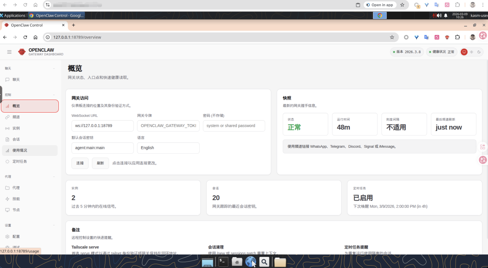

<div align="center">
  <h1>Agent Workspace</h1>
  <p>Cloud Desktop for AI Agents</p>
  <p>
    <a href="README.md">中文</a> &bull;
    <a href="README_en.md">English</a>
  </p>
</div>

---

A containerized cloud desktop based on [LinuxServer Webtop](https://docs.linuxserver.io/images/docker-webtop/) (Selkies WebRTC), providing an isolated development and runtime environment for AI agents (OpenClaw, Openfang, etc.).



## Features

- **Selkies WebRTC Desktop** — Full Linux desktop via browser (HTTPS), with Wayland, adaptive resolution, and [dynamic HiDPI scaling](docs/hidpi-scaling.md)
- **3 Desktop Environments** — LXQt (lightweight ~300MB) / XFCE (medium ~800MB) / KDE (full ~1.1GB)
- **Complete Dev Toolchain** — Node.js 22, Go 1.22, Rust, Python 3, Homebrew, uv
- **Multiple Docker Modes** — Disabled / DinD (standalone Docker inside container) / Host Docker socket mount
- **GPU Acceleration** — Auto-detect NVIDIA / Intel / AMD GPU for hardware rendering and encoding
- **China Mirror Support** — Switch to China mirrors at runtime with `USE_CHINA_MIRROR=true` (APT, npm, pip, Go, Rust, Homebrew)
- **Data Persistence** — LinuxServer `/config` standard mount for all tools, caches, and user data
- **systemctl Process Management** — Manage agent processes via docker-systemctl-replacement

## Quick Start

### One-Click Install (Recommended)

Interactive script with 9-step guided setup (language, desktop, Docker mode, registry, version, data dir, port, agents, agent ports):

**Linux / macOS**
```bash
# China users (GitCode mirror)
curl -fsSL https://raw.gitcode.com/fliaping0/agent-workspace/raw/main/install.sh | bash

# International users (GitHub)
curl -fsSL https://raw.githubusercontent.com/fliaping/agent-workspace/main/install.sh | bash
```

**Windows (PowerShell)**
```powershell
# China users (GitCode mirror)
irm https://raw.gitcode.com/fliaping0/agent-workspace/raw/main/install.ps1 -OutFile install.ps1; .\install.ps1

# International users (GitHub)
irm https://raw.githubusercontent.com/fliaping/agent-workspace/main/install.ps1 -OutFile install.ps1; .\install.ps1
```

### Docker CLI

```bash
docker run -d --name agent-workspace \
  --restart unless-stopped --shm-size 2gb \
  -e PUID=1000 -e PGID=1000 \
  -e TZ=Etc/UTC \
  -e SELKIES_ENABLE_WAYLAND=true \
  -e PIXELFLUX_WAYLAND=false \
  -p 3001:3001 \
  -v ~/agent-workspace-data:/config \
  xuping/agent-workspace:ubuntu-lxqt
```

Access the desktop at **https://localhost:3001**.

> China mirror: `registry.cn-hangzhou.aliyuncs.com/fliaping/agent-workspace:ubuntu-lxqt`

### Docker Compose

```bash
git clone https://github.com/fliaping/agent-workspace.git
cd agent-workspace
# Edit docker-compose.yml as needed
docker compose up -d
```

## Image Tags

| Tag | Description |
|-----|-------------|
| `ubuntu-lxqt` | LXQt desktop (default, lightest) |
| `ubuntu-xfce` | XFCE desktop |
| `ubuntu-kde` | KDE desktop |

## Environment Variables

| Variable | Default | Description |
|----------|---------|-------------|
| `PUID` / `PGID` | `1000` | Container user/group ID |
| `TZ` | `Etc/UTC` | Timezone |
| `LC_ALL` | - | Locale (e.g., `zh_CN.UTF-8`) |
| `SELKIES_ENABLE_WAYLAND` | `true` | Enable Wayland display protocol |
| `PIXELFLUX_WAYLAND` | `false` | Force X11 mode (`true` breaks CJK input in Selkies) |
| `SELKIES_SCALING_DPI` | unset | DPI scaling (unset = Selkies auto-adapts to browser zoom; set to 192 for always-HiDPI) |
| `SELKIES_USE_BROWSER_CURSORS` | `true` | CSS cursor rendering, zero-latency mouse |
| `SELKIES_CONGESTION_CONTROL` | `true` | Network congestion control, adaptive bitrate |
| `SELKIES_H264_CRF` | `28` | H264 quality (5-50, higher = lower quality, less latency) |
| `SELKIES_JPEG_QUALITY` | `30` | JPEG fallback quality (1-100, default 40) |
| `SELKIES_H264_STREAMING_MODE` | `true` | H264 streaming mode, reduces encoding latency |
| `START_DOCKER` | `false` | Enable Docker inside container (requires `--privileged`) |
| `USE_CHINA_MIRROR` | `false` | Switch to China mirrors at runtime |
| `SSH_PASSWORD` | unset | Set to enable SSH service (port 22), value is abc user password |
| `NODE_OPTIONS` | - | Node.js options (e.g., `--max-old-space-size=2048`) |

## Docker Modes

| Mode | Configuration | Description |
|------|---------------|-------------|
| Disabled | Default | No Docker functionality |
| DinD | `--privileged` + `START_DOCKER=true` | Standalone Docker engine inside container |
| Host Socket | `-v /var/run/docker.sock:/var/run/docker.sock` | Share host Docker daemon |

## GPU Acceleration

| GPU Type | Configuration |
|----------|---------------|
| NVIDIA | `--gpus all -e NVIDIA_VISIBLE_DEVICES=all -e NVIDIA_DRIVER_CAPABILITIES=all --device /dev/dri:/dev/dri` |
| Intel/AMD | `--device /dev/dri:/dev/dri -e DRINODE=/dev/dri/renderD128` |

> The install script auto-detects GPU and configures accordingly.

## Built-in Toolchain

| Tool | Version | Notes |
|------|---------|-------|
| Node.js | 22 LTS | + npm, pnpm, TypeScript |
| Go | 1.22.4 | |
| Rust | stable | + Cargo |
| Python 3 | System | + pip, venv, uv |
| Homebrew | Latest | Linux version, persisted to data dir |
| docker-systemctl-replacement | Latest | systemd replacement for agent process management |

## Application Capability Management

The image focuses on stable system dependencies, desktop/runtime tooling, and
base s6 services. Faster-moving application capabilities such as proxy routing,
code-server extensions, and Agent installers are managed by
`agent-workspace-manager` and installed under the persistent `/config` volume.

Run it inside the container to open the TUI:

```bash
agent-workspace-manager
```

The TUI supports Up/Down selection and Enter to run actions. Download and
installation output stays in the in-app log panel instead of writing back to the
raw terminal. Agent installation is handled by the manager flow itself; it does
not launch a nested TUI.

Common commands:

```bash
# Update application source to /config/agent-workspace-manager/source
agent-workspace-manager update

# Install foundation capabilities: proxyctl, code-server extensions, custom s6 registration
agent-workspace-manager install foundation

# Show application capability status
agent-workspace-manager status
```

Set `AGENT_WORKSPACE_SOURCE_DIR` to use an existing checkout while developing.
By default, source is persisted at `/config/agent-workspace-manager/source`.
See [Agent Workspace Manager](docs/agent-workspace-manager.md).

## Agent Software

`agent-workspace-manager install agents` uses the manager's own install flow for:

| Agent | Default Port | Install Method |
|-------|--------------|----------------|
| OpenClaw | 18789 | npm |
| Openfang | 4200 | cargo build |
| ZeroClaw | 42617 | brew |

Manage agent processes with **systemctl**:

```bash
# Check status
docker exec agent-workspace systemctl status openclaw

# View logs
docker exec agent-workspace journalctl -u openclaw

# Restart
docker exec agent-workspace systemctl restart openclaw
```

## Optional Capability Modules

The repository includes optional modules that can be installed into a running
workspace when needed. Use `agent-workspace-manager` for normal installation;
the module source remains available for development:

| Module | Path | Description |
|--------|------|-------------|
| proxyctl + Caddy routing | `addons/proxyctl` | Lightweight Caddy reverse proxy, named routes, and code-server subdomain port proxy |
| Service Manager extension | `extensions/service-manager` | View and manage s6 / systemd services from the code-server sidebar |
| Caddy Proxy extension | `extensions/caddy-proxy-manager` | View and manage proxyctl routes from the code-server sidebar |
| Custom s6 services | `scripts/register-config-services.sh` | Automatically register `/config/custom-services.d/<name>/run` with s6 |

Install the code-server extensions:

```bash
agent-workspace-manager install code-server-extensions
```

See `addons/proxyctl/README.md` for proxyctl details and [code-server Extensions](docs/code-server-extensions.md) for extension usage.

## Data Persistence

The container's `/config` directory is mapped to the host data directory. Persisted data includes:

- Homebrew packages (`/config/.linuxbrew`; `/home/linuxbrew/.linuxbrew` is only a compatibility symlink and does not need a separate mount)
- npm global packages (`/config/.npm-global`)
- Go workspace (`/config/go`)
- Cargo packages (`/config/.cargo`)
- pip/uv cache (`/config/.cache`)
- Desktop settings and user files
- Custom s6 services (`/config/custom-services.d/<name>/run`, automatically registered into `/run/service` at startup)

### Custom s6 Services

At startup, the built-in `custom-services` s6 service scans `/config/custom-services.d` after the base `init` service completes and registers services with s6.

Create services as:

```text
/config/custom-services.d/<service-name>/run
```

The `run` file must be executable. After container recreation, services are automatically registered and started as long as `/config` is persisted. See [Persistent Custom s6 Services](docs/custom-s6-services.md).

## Custom Build

```bash
git clone https://github.com/fliaping/agent-workspace.git
cd agent-workspace

# Default build (LXQt + international mirrors)
docker compose build

# KDE desktop
DESKTOP=kde docker compose build

# China mirrors for faster build
USE_CHINA_MIRROR=true docker compose build
```

## Common Commands

```bash
# View logs
docker logs -f agent-workspace

# Enter container
docker exec -it agent-workspace bash

# Stop/Start
docker stop agent-workspace
docker start agent-workspace
```

## Notes

- Selkies WebRTC has no password by default. Use a reverse proxy with authentication for public exposure.
- Homebrew is persisted to `/config/.linuxbrew`; do not mount `/home/linuxbrew/.linuxbrew` separately.
- LinuxServer automatically initializes the `/config` directory on first startup.

## Architecture Support

| Architecture | Docker Platform |
|-------------|-----------------|
| x86-64 | `linux/amd64` |
| ARM64 | `linux/arm64` |

## Links

- [LinuxServer Webtop Docs](https://docs.linuxserver.io/images/docker-webtop/)
- [Docker Hub](https://hub.docker.com/r/xuping/agent-workspace)
- [GitHub](https://github.com/fliaping/agent-workspace)
