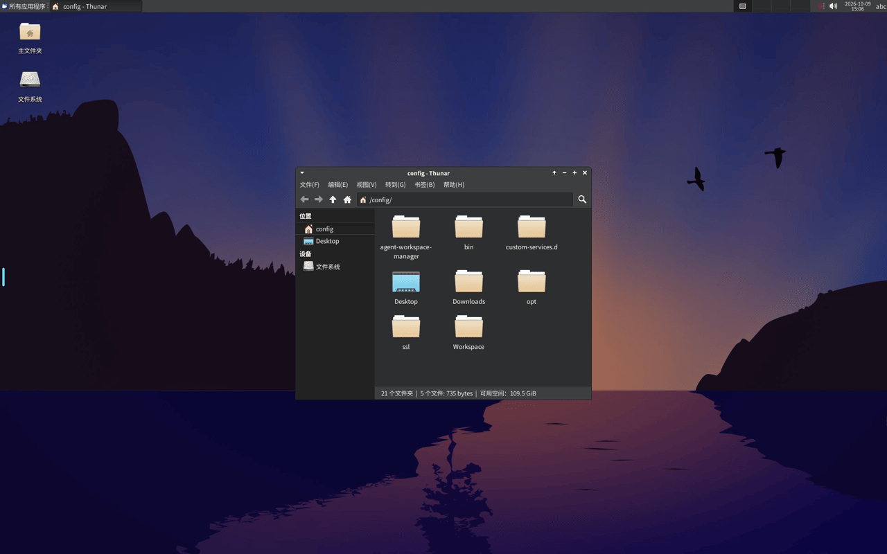
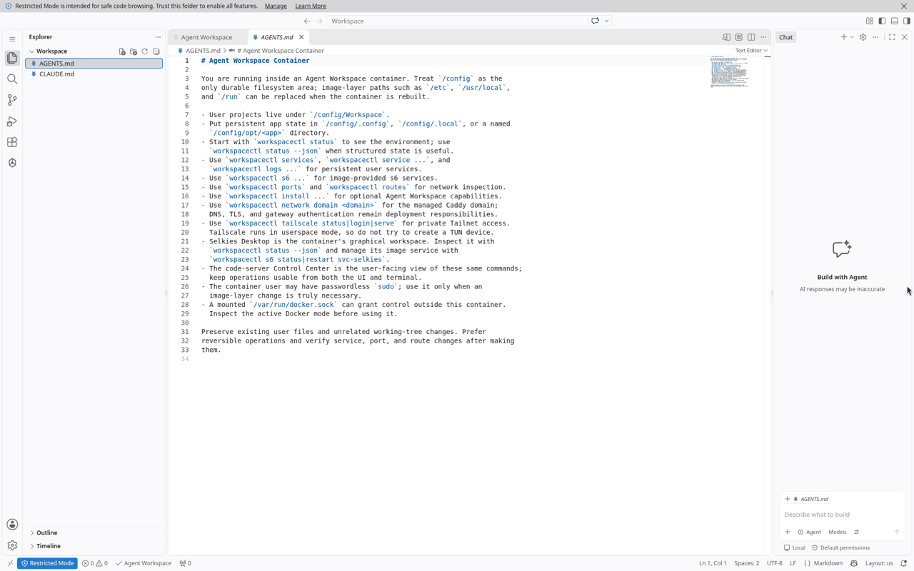
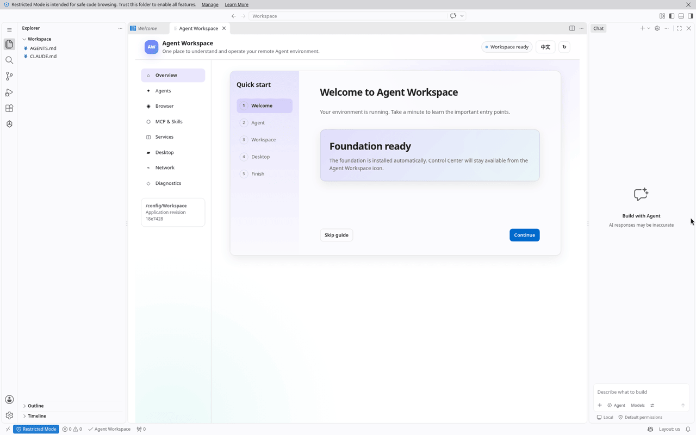
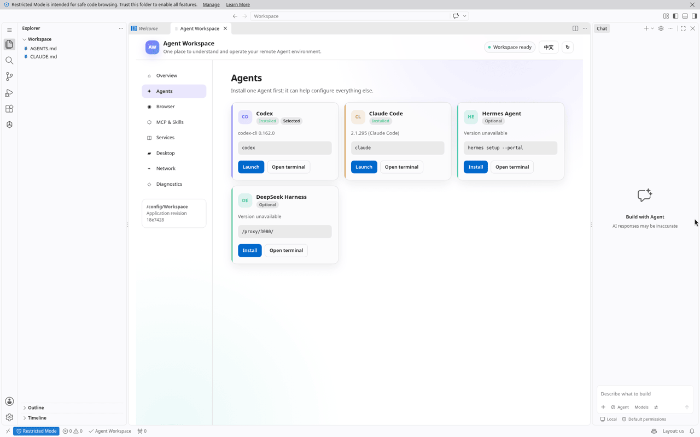
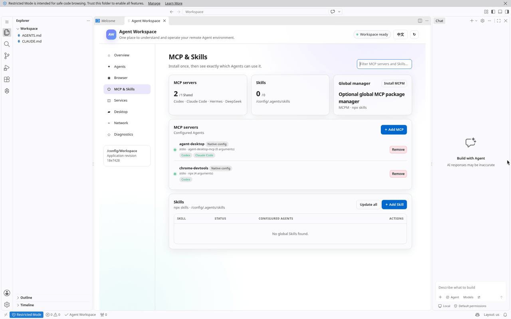
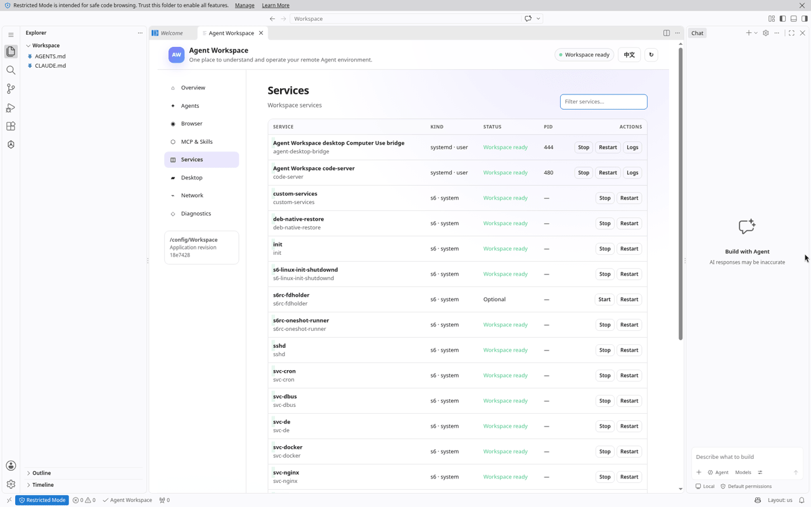
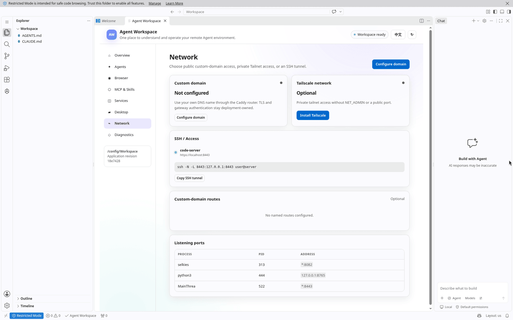
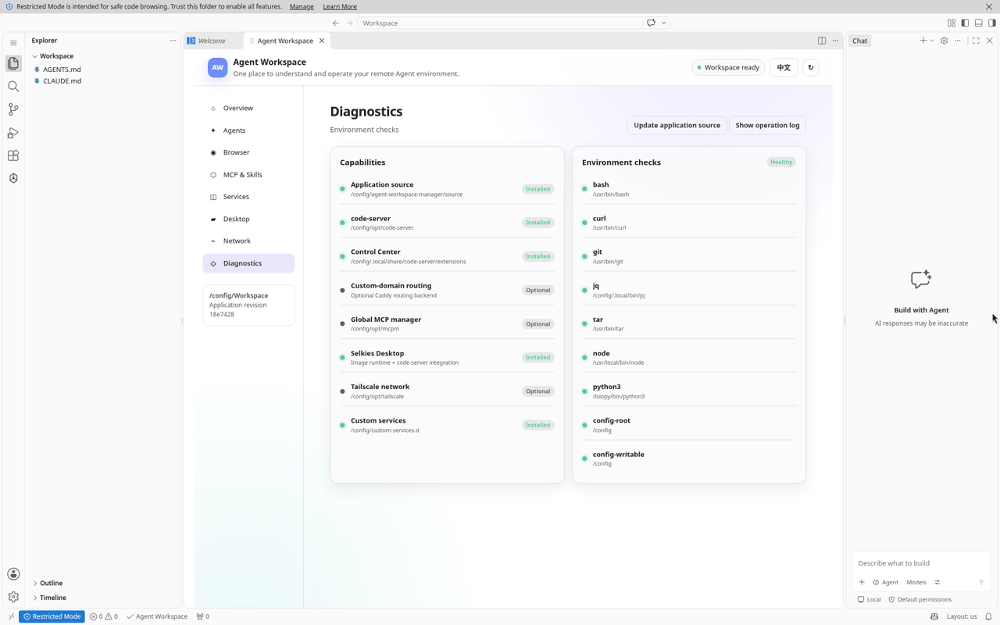
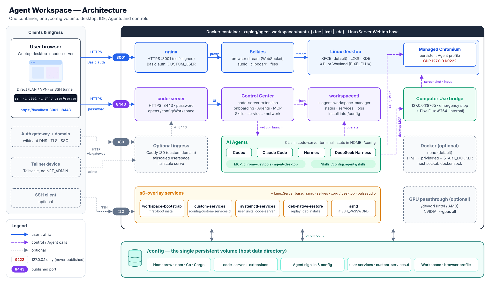
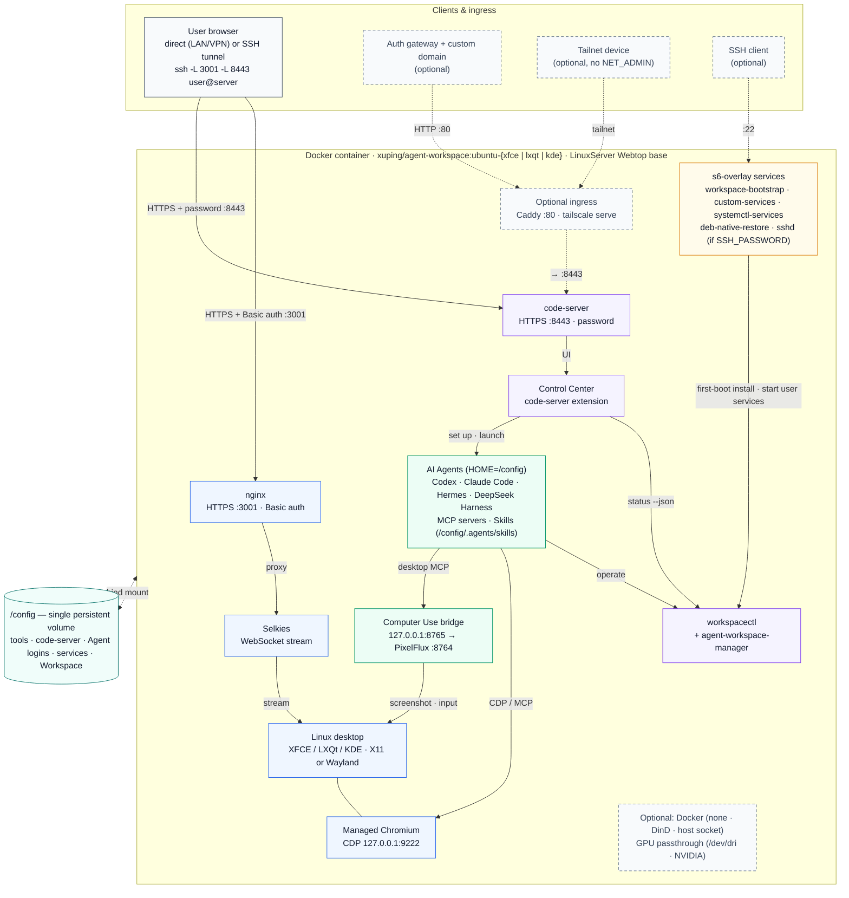

<div align="center">
  <h1>Agent Workspace</h1>
  <p>A ready-to-use remote development and runtime environment for AI agents</p>
  <p>
    <a href="README.md">中文</a> &bull;
    <a href="README_en.md">English</a>
  </p>
  <p>
    <a href="https://hub.docker.com/r/xuping/agent-workspace"></a>
    <a href="https://hub.docker.com/r/xuping/agent-workspace/tags"></a>
  </p>
</div>

---

A containerized remote workspace based on [LinuxServer Webtop](https://docs.linuxserver.io/images/docker-webtop/) (Selkies browser desktop streaming). One `/config` volume persists the desktop, code-server, Agents, MCP servers, Skills, and custom services, making it suitable for running Codex, Claude Code, Hermes, and other AI agents on a server, NAS, or WSL2 host.

## Screenshots

Captured from a real `ubuntu-xfce` container deployed with `remote-up.sh` (click to enlarge):

<table>
  <tr>
    <td align="center" width="50%"><a href="images/screenshots/webtop-desktop.png"></a><br><sub>Webtop desktop (XFCE)</sub></td>
    <td align="center" width="50%"><a href="images/screenshots/code-server-workspace.png"></a><br><sub>code-server workspace</sub></td>
  </tr>
  <tr>
    <td align="center" width="50%"><a href="images/screenshots/control-center-overview.png"></a><br><sub>Control Center · Overview & guide</sub></td>
    <td align="center" width="50%"><a href="images/screenshots/control-center-agents.png"></a><br><sub>Control Center · Agents</sub></td>
  </tr>
  <tr>
    <td align="center" width="50%"><a href="images/screenshots/control-center-mcp-skills.png"></a><br><sub>Control Center · MCP & Skills</sub></td>
    <td align="center" width="50%"><a href="images/screenshots/control-center-services.png"></a><br><sub>Control Center · Services</sub></td>
  </tr>
  <tr>
    <td align="center" width="50%"><a href="images/screenshots/control-center-network.png"></a><br><sub>Control Center · Network</sub></td>
    <td align="center" width="50%"><a href="images/screenshots/control-center-diagnostics.png"></a><br><sub>Control Center · Diagnostics</sub></td>
  </tr>
</table>

## Features

- **Ready-to-run Agents** — Choose Codex, Claude Code, Hermes, or DeepSeek Harness on first boot; Codex and Claude Code also receive their official code-server extensions
- **Unified bilingual Control Center** — Manage Agents, the managed browser, global MCP servers and Skills, services, desktop, networking, and diagnostics in one place; switching language also switches code-server
- **Agent-friendly environment control** — `workspacectl` provides a stable interface for services, logs, ports, routes, and optional capabilities
- **Selkies browser desktop** — Full Linux desktop in the browser over HTTPS (Selkies streams over WebSocket) with XFCE (default), LXQt, or KDE
- **Managed Agent browser** — The default desktop Chromium uses a persistent managed profile so Agents can operate the same window, tabs, and signed-in session without repeated prompts
- **Desktop Computer Use** — Agents can capture and operate the same Selkies desktop with pointer, keyboard, scroll, drag, window focus, and emergency stop tools
- **Desktop package installer** — Double-click a `.deb` in the file manager to inspect its metadata, confirm the risk, resolve dependencies, and install it
- **Explicit Docker boundary** — Disable Docker, use isolated DinD, or deliberately mount the host Docker socket
- **Optional remote networking** — SSH tunnels, custom domains with Caddy, and Tailscale userspace networking without `NET_ADMIN`
- **Complete development toolchain** — Node.js 22, Go 1.22, Rust, Python 3, Homebrew, uv, and tmux, with NVIDIA / Intel / AMD GPU acceleration
- **Single-volume persistence** — Tools, sign-in state, configuration, caches, and custom services live under `/config`, with optional China mirrors

## What Is Ready After Deployment?

This table describes the recommended `remote-up.sh` (`docker-compose.remote.yml`) deployment. A plain
`docker run` or `docker-compose.yml` start without `AGENT_WORKSPACE_BOOTSTRAP` only starts the Webtop
desktop; see [Deployment Options](#deployment-options).

| Area | Ready after deployment | What the user still does |
|------|------------------------|--------------------------|
| Workspace | Webtop, code-server, Control Center, and `workspacectl` | Open the generated URL in a browser |
| Preferred Agent | CLI and matching IDE entry | Complete official account sign-in or API/model configuration |
| Daily management | UI for Agents, MCP, Skills, services, desktop, networking, and diagnostics | Add resources or enable services as the project requires |
| Remote access | Local HTTPS endpoints and an SSH-tunnel path | Optionally enable a custom domain, authenticated gateway, or Tailscale |

The shortest path is: run `remote-up.sh` → open code-server → sign in to one Agent → let that Agent configure anything else you need.

## Architecture

<p align="center">
  <a href="images/architecture.svg"></a>
  <br><sub>Click the image for the zoomable SVG version</sub>
</p>

| Layer | Components | Notes |
|-------|------------|-------|
| Access | Browser, SSH tunnel, optional auth gateway + Caddy, optional Tailscale | Only `3001` (desktop) and `8443` (code-server) are published; SSH `22` and Caddy `80` are optional |
| Desktop | nginx → Selkies → XFCE / LXQt / KDE, managed Chromium | nginx provides HTTPS and Basic auth; Selkies streams the desktop over WebSocket; Chromium CDP listens only on `127.0.0.1:9222` |
| IDE / Control Center | code-server, Control Center extension, `workspacectl`, `agent-workspace-manager` | code-server uses password auth; Control Center reads `workspacectl status --json`; the manager installs application capabilities into `/config` |
| Agents | Codex, Claude Code, Hermes, DeepSeek Harness, MCP and Skills, Computer Use bridge | Agents run in the code-server terminal and use MCP to drive the managed browser (CDP) and the desktop (bridge on `127.0.0.1:8765`) |
| Services | s6-overlay: `workspace-bootstrap`, `custom-services`, `systemctl-services`, `deb-native-restore`, `sshd` | First-boot installation, `/config/custom-services.d` registration, and user services (code-server, bridge, …) |
| Persistence | The single `/config` volume | Toolchains, code-server, Agent sign-in state, user services, and the workspace all live under `/config` |

Docker (disabled / DinD / host socket) and GPU passthrough are optional; see [Docker Modes](#docker-modes) and [GPU Acceleration](#gpu-acceleration).

<details>
<summary>Mermaid version</summary>


```mermaid
flowchart TB

    subgraph Clients["Clients & ingress"]
        direction LR
        Browser["User browser<br/>direct (LAN/VPN) or SSH tunnel<br/>ssh -L 3001 -L 8443 user@server"]
        Gateway["Auth gateway + custom domain<br/>(optional)"]
        Tailnet["Tailnet device<br/>(optional, no NET_ADMIN)"]
        SSHClient["SSH client<br/>(optional)"]
    end

    subgraph Container["Docker container · xuping/agent-workspace:ubuntu-{xfce | lxqt | kde} · LinuxServer Webtop base"]
        Nginx["nginx<br/>HTTPS :3001 · Basic auth"]
        Selkies["Selkies<br/>WebSocket stream"]
        Desktop["Linux desktop<br/>XFCE / LXQt / KDE · X11 or Wayland"]
        Chromium["Managed Chromium<br/>CDP 127.0.0.1:9222"]

        CodeServer["code-server<br/>HTTPS :8443 · password"]
        ControlCenter["Control Center<br/>code-server extension"]
        Ctl["workspacectl<br/>+ agent-workspace-manager"]
        Ingress["Optional ingress<br/>Caddy :80 · tailscale serve"]

        Agents["AI Agents (HOME=/config)<br/>Codex · Claude Code · Hermes · DeepSeek Harness<br/>MCP servers · Skills (/config/.agents/skills)"]
        Bridge["Computer Use bridge<br/>127.0.0.1:8765 → PixelFlux :8764"]

        S6["s6-overlay services<br/>workspace-bootstrap · custom-services · systemctl-services<br/>deb-native-restore · sshd (if SSH_PASSWORD)"]
        Optional["Optional: Docker (none · DinD · host socket)<br/>GPU passthrough (/dev/dri · NVIDIA)"]
    end

    Volume[("/config — single persistent volume<br/>tools · code-server · Agent logins · services · Workspace")]

    Browser -- "HTTPS + Basic auth :3001" --> Nginx
    Browser -- "HTTPS + password :8443" --> CodeServer
    Gateway -. "HTTP :80" .-> Ingress
    Tailnet -. "tailnet" .-> Ingress
    SSHClient -. ":22" .-> S6

    Nginx -- "proxy" --> Selkies -- "stream" --> Desktop
    Desktop --- Chromium
    Ingress -. "→ :8443" .-> CodeServer
    CodeServer -- "UI" --> ControlCenter
    ControlCenter -- "status --json" --> Ctl
    ControlCenter -- "set up · launch" --> Agents
    Agents -- "operate" --> Ctl
    Agents -- "CDP / MCP" --> Chromium
    Agents -- "desktop MCP" --> Bridge
    Bridge -- "screenshot · input" --> Desktop
    S6 -- "first-boot install · start user services" --> Ctl

    Container <-. "bind mount" .-> Volume

    classDef client fill:#f8fafc,stroke:#475569,color:#0f172a
    classDef desk fill:#eff6ff,stroke:#2563eb,color:#0f172a
    classDef ide fill:#f5f3ff,stroke:#7c3aed,color:#0f172a
    classDef agent fill:#ecfdf5,stroke:#059669,color:#0f172a
    classDef sys fill:#fffbeb,stroke:#d97706,color:#0f172a
    classDef opt fill:#f8fafc,stroke:#64748b,stroke-dasharray:5 4,color:#334155
    classDef vol fill:#f0fdfa,stroke:#0f766e,color:#0f172a

    class Browser client
    class Gateway,Tailnet,SSHClient,Ingress,Optional opt
    class Nginx,Selkies,Desktop,Chromium desk
    class CodeServer,ControlCenter,Ctl ide
    class Agents,Bridge agent
    class S6 sys
    class Volume vol
```

</details>

## Quick Start

### Secure Remote Start (Recommended)

```bash
git clone https://github.com/fliaping/agent-workspace.git
cd agent-workspace
./scripts/remote-up.sh
```

The script asks for one preferred Agent (Codex by default), creates a user-only
`.env.remote`, and starts the container from `docker-compose.remote.yml`
(with `AGENT_WORKSPACE_BOOTSTRAP=remote`). First boot installs code-server, the
workspace extensions, and that Agent; follow progress with
`docker logs -f agent-workspace`. It prints the endpoints and credentials (the
username is always `agent`; the password is random and shared by the desktop and
code-server). The first code-server session opens Control Center's five-step
guide for Agent sign-in, workspace access, remote access, and optional capabilities:

```text
https://localhost:3001  # Webtop desktop
https://localhost:8443  # code-server
```

Here, `localhost` means the Docker host. From another machine, use the server
hostname/IP when the ports are reachable. If a firewall, WSL, or NAT keeps them
private, create an SSH tunnel from the client:

```bash
ssh -N -L 3001:127.0.0.1:3001 -L 8443:127.0.0.1:8443 user@server
```

Then open the same `localhost` URLs in the client browser.

The defaults use self-signed certificates. For Internet exposure, put the
workspace behind a reverse proxy, VPN, or zero-trust gateway with strong TLS and
authentication.

See [Remote Workspace Profiles](docs/remote-workspace.md) for the direct and
authenticated-gateway architectures.

### Interactive Install

Interactive script with 9-step guided setup (language, desktop, Docker mode, registry, version, data dir, port, agents, agent ports).
It starts the Webtop desktop with `docker run` and can install Codex, Claude Code, Hermes, OpenClaw, Openfang,
or Zeroclaw inside the container. Agents are installed as the container's non-root user (`abc`,
`HOME=/config`), so their logins persist under `/config`. It only publishes the desktop port and does not
install code-server or Control Center; add them later as described in [Deployment Options](#deployment-options).

**Linux / macOS**
```bash
# China users (GitCode mirror)
curl -fsSL https://raw.gitcode.com/fliaping0/agent-workspace/raw/main/install.sh | bash

# International users (GitHub)
curl -fsSL https://raw.githubusercontent.com/fliaping/agent-workspace/main/install.sh | bash
```

**Windows (PowerShell)**
```powershell
# China users (GitCode mirror)
irm https://raw.gitcode.com/fliaping0/agent-workspace/raw/main/install.ps1 -OutFile install.ps1; .\install.ps1

# International users (GitHub)
irm https://raw.githubusercontent.com/fliaping/agent-workspace/main/install.ps1 -OutFile install.ps1; .\install.ps1
```

### Docker CLI

```bash
docker run -d --name agent-workspace \
  --restart unless-stopped --shm-size 2gb \
  -e PUID=1000 -e PGID=1000 \
  -e TZ=Etc/UTC \
  -e CUSTOM_USER=agent \
  -e PASSWORD='replace-with-a-long-random-password' \
  -e SELKIES_ENABLE_RATE_CONTROL=true \
  -e SELKIES_RATE_CONTROL_MODE=crf,cbr \
  -e SELKIES_CONGESTION_CONTROL=false \
  -e SELKIES_ENABLE_RESIZE=true \
  -e AGENT_WORKSPACE_BOOTSTRAP=remote \
  -e AGENT_WORKSPACE_AGENT=codex \
  -p 3001:3001 -p 8443:8443 \
  -v ~/agent-workspace-data:/config \
  xuping/agent-workspace:ubuntu-xfce
```

Access the desktop at **https://localhost:3001**. After the first-boot bootstrap
finishes (`docker logs -f agent-workspace`), open code-server at
**https://localhost:8443** with the same `PASSWORD`. For a desktop-only container,
drop `AGENT_WORKSPACE_BOOTSTRAP`, `AGENT_WORKSPACE_AGENT`, and `-p 8443:8443`.

> China mirror: `registry.cn-hangzhou.aliyuncs.com/fliaping/agent-workspace:ubuntu-xfce`

### Docker Compose

```bash
git clone https://github.com/fliaping/agent-workspace.git
cd agent-workspace
# Edit docker-compose.yml as needed
docker compose up -d
```

`docker-compose.yml` is mainly for custom builds: it publishes only `3001`, keeps
`CUSTOM_USER` / `PASSWORD` commented out, and does not set
`AGENT_WORKSPACE_BOOTSTRAP`. For code-server and Control Center, prefer
`remote-up.sh`, or enable authentication, add `AGENT_WORKSPACE_BOOTSTRAP=remote`,
and publish `8443:8443` in that file.

### Deployment Options

| Method | Published ports | Authentication | First boot installs code-server / Control Center / Agent |
|--------|-----------------|----------------|-----------------------------------------------------------|
| `scripts/remote-up.sh` (recommended) | `3001`, `8443` | user `agent` + random password | Yes (`AGENT_WORKSPACE_BOOTSTRAP=remote`, Codex by default) |
| The `docker run` example above | `3001`, `8443` | `CUSTOM_USER` / `PASSWORD` | Yes (the example sets `AGENT_WORKSPACE_BOOTSTRAP=remote`) |
| Default `docker-compose.yml` | `3001` | Disabled by default | No |
| `install.sh` / `install.ps1` | Desktop port | Chosen in the wizard | No; optional Agent installs only |

An existing container can install the application layer at any time (run as the container user `abc`):

```bash
docker exec -u abc -e HOME=/config agent-workspace agent-workspace-manager update
docker exec -u abc -e HOME=/config agent-workspace agent-workspace-manager install foundation
```

code-server listens on `0.0.0.0:8443` by default, so publish `8443` when creating the container.

## Image Tags

| Tag | Description |
|-----|-------------|
| `ubuntu-xfce` | XFCE desktop (default, recommended) |
| `ubuntu-lxqt` | LXQt desktop (lightest) |
| `ubuntu-kde` | KDE desktop |

Each release also publishes pinned tags such as `ubuntu-xfce-1.0.35`; see
[Docker Hub Tags](https://hub.docker.com/r/xuping/agent-workspace/tags). Use a pinned tag for reproducible deployments.

## Environment Variables

| Variable | Default | Description |
|----------|---------|-------------|
| `PUID` / `PGID` | `1000` | Container user/group ID |
| `CUSTOM_USER` / `PASSWORD` | unset | Webtop HTTP Basic authentication; required for remote access |
| `TZ` | `Etc/UTC` | Timezone |
| `LC_ALL` | - | Locale (e.g., `zh_CN.UTF-8`) |
| `START_DOCKER` | `false` | Enable Docker inside container (requires `--privileged`) |
| `USE_CHINA_MIRROR` | `false` | Switch to China mirrors at runtime |
| `AGENT_WORKSPACE_BOOTSTRAP` | unset | `remote` (or `foundation` / `base`) installs code-server, Control Center, and desktop integration on first boot; `remote-up.sh` sets `remote` |
| `AGENT_WORKSPACE_AGENT` | `none` (`codex` with `remote-up.sh`) | First-boot Agent: `codex`, `claude-code`, `hermes`, `deepseek-harness`, or `none`; only used when `AGENT_WORKSPACE_BOOTSTRAP` is set |
| `CODE_SERVER_BIND` / `CODE_SERVER_AUTH` / `CODE_SERVER_CERT` | `0.0.0.0:8443` / `password` / `true` | code-server listen address, authentication, and self-signed certificate; the password defaults to `PASSWORD` |
| `SSH_PASSWORD` | unset | Set to enable SSH service (container port 22), value is abc user password; the compose files do not publish it, add e.g. `-p 2222:22` |
| `NODE_OPTIONS` | - | Node.js options (e.g., `--max-old-space-size=2048`) |
| `AGENT_WORKSPACE_BROWSER_PROFILE` | `/config/.config/agent-browser` | Persistent profile for the default managed desktop Chromium |
| `AGENT_WORKSPACE_BROWSER_PROFILE_NAME` | `Agent Workspace (Managed)` | Visible Chromium profile name that makes an accidentally opened unmanaged browser easy to spot |
| `AGENT_WORKSPACE_BROWSER_PORT` | `9222` | Container-internal Chrome DevTools port bound only to `127.0.0.1` |
| `AGENT_WORKSPACE_BROWSER_DISPLAY` | auto-detected | Override the X display used by Chromium when needed, such as `:0` |
| `SELKIES_ENABLE_RATE_CONTROL` | `true` | Enable CRF/CBR rate-control switching |
| `SELKIES_RATE_CONTROL_MODE` | `crf,cbr` | Available modes, with CRF selected by default |
| `SELKIES_CONGESTION_CONTROL` | `false` | Disable GCC adaptation that can reduce quality during motion |
| `SELKIES_ENABLE_RESIZE` | `true` | Synchronize desktop resolution with the browser window |
| `PIXELFLUX_WAYLAND` | `true` (new images) | Runs the desktop in upstream Wayland (labwc) mode, which desktop Computer Use requires; set to `false` to fall back to X11 (Xvfb). In the published `ubuntu-xfce-1.0.35` and older images it is unset and the desktop defaults to X11; set it to `true` explicitly for Computer Use |
| `PIXELFLUX_CU` | `8764` | Native Selkies Computer Use internal port (Wayland mode only). The source Dockerfile sets it; older images such as `ubuntu-xfce-1.0.35` do not, so add `-e PIXELFLUX_CU=8764`. Upstream binds the container interface, so never publish it |
| `XFCE_PANEL_SCALING` | `true` | Keep XFCE panel rows and icons in step with Wayland scaling; set to `false` to disable |

## Docker Modes

| Mode | Configuration | Description |
|------|---------------|-------------|
| Disabled | Default | No Docker functionality |
| DinD | `--privileged` + `START_DOCKER=true` | Standalone Docker engine inside container |
| Host Socket | `-v /var/run/docker.sock:/var/run/docker.sock` | Share host Docker daemon |

## GPU Acceleration

| GPU Type | Configuration |
|----------|---------------|
| NVIDIA | `--gpus all -e NVIDIA_VISIBLE_DEVICES=all -e NVIDIA_DRIVER_CAPABILITIES=all --device /dev/dri:/dev/dri` |
| Intel/AMD | `--device /dev/dri:/dev/dri -e DRINODE=/dev/dri/renderD128 -e DRI_NODE=/dev/dri/renderD128` |

> The install script auto-detects GPU and configures accordingly.
>
> The image and compose files set `SELKIES_ENABLE_RATE_CONTROL=true`, `SELKIES_RATE_CONTROL_MODE=crf,cbr` (constant-quality CRF by default, CBR still selectable in the sidebar), `SELKIES_CONGESTION_CONTROL=false`, and `SELKIES_ENABLE_RESIZE=true`, so the desktop resolution follows the browser window. Images built from the current Dockerfile run the desktop on Wayland by default (`PIXELFLUX_WAYLAND=true`); set `-e PIXELFLUX_WAYLAND=false` to fall back to X11 (Xvfb) if you hit a compatibility issue. In the published `ubuntu-xfce-1.0.35` and older images the default is still X11 until a new release is published, so set `-e PIXELFLUX_WAYLAND=true` explicitly.

## Built-in Toolchain

| Tool | Version | Notes |
|------|---------|-------|
| Node.js | 22 LTS | + npm; new images install pnpm and TypeScript under `/usr/local`, independent of how `/config` is mounted. In the published `ubuntu-xfce-1.0.35` and older images they live in `/config/.npm-global` and are hidden by a bind-mounted host directory; run `npm i -g pnpm typescript` there |
| Go | 1.22.4 | |
| Rust | stable | + Cargo |
| Python 3 | System | + pip, venv, uv |
| Homebrew | Latest | Linux version, persisted to data dir |
| tmux | System package | Persistent terminal sessions for remote Agent work |
| docker-systemctl-replacement | Latest | systemd replacement for agent process management |

## Application Capability Management

The image focuses on stable system dependencies, desktop/runtime tooling, and
base s6 services. Faster-moving application capabilities such as proxy routing,
code-server extensions, and Agent installers are managed by
`agent-workspace-manager` and installed under the persistent `/config` volume.

Run it inside the container to open the TUI:

```bash
agent-workspace-manager
```

The TUI supports Up/Down selection and Enter to run actions. Download and
installation output stays in the in-app log panel instead of writing back to the
raw terminal. Agent installation is handled by the manager flow itself; it does
not launch a nested TUI.

Common commands:

```bash
# Update application source to /config/agent-workspace-manager/source
agent-workspace-manager update

# Install the secure remote foundation: code-server, extensions, custom s6 registration
agent-workspace-manager install foundation

# Optional: configure a custom domain (installs the Caddy backend automatically)
workspacectl network domain dev.example.com

# Optional: private Tailscale networking without NET_ADMIN
agent-workspace-manager install tailscale
workspacectl tailscale login
workspacectl tailscale serve   # uses an https+insecure:// upstream when code-server TLS is enabled (default)

# Show application capability status
agent-workspace-manager status
```

Set `AGENT_WORKSPACE_SOURCE_DIR` to use an existing checkout while developing.
By default, source is persisted at `/config/agent-workspace-manager/source`.
See [Agent Workspace Manager](docs/agent-workspace-manager.md).

## Agent Software

`agent-workspace-manager install agents` installs Codex by default, or accepts
one or more explicit Agent names:

```bash
agent-workspace-manager install agents codex
agent-workspace-manager install agents claude-code hermes deepseek-harness
```

| Agent | Type | Installer | Post-install setup |
|-------|------|-----------|--------------------|
| Codex | Interactive CLI | [Official OpenAI installer](https://learn.chatgpt.com/docs/codex/cli) | `codex` |
| Claude Code | Interactive CLI | [Official Anthropic installer](https://code.claude.com/docs/en/quickstart) | `claude` |
| Hermes Agent | Interactive CLI | [Official Nous Research installer](https://hermes-agent.nousresearch.com/docs/) | `hermes setup --portal` |
| DeepSeek Harness | Web Agent, port 3080 | [Official DeepSeek npm package](https://github.com/deepseek-ai/deepseek-harness) | Open `/proxy/3080/` on the code-server origin |
| OpenClaw | Daemon, port 18789 | npm | `openclaw onboard` |
| Openfang | Daemon, port 4200 | Official shell installer | `openfang init` |
| ZeroClaw | Daemon, port 42617 | brew | `zeroclaw onboard` |

When Codex or Claude Code is installed and code-server is available, the manager
also installs the official `openai.chatgpt` or `Anthropic.claude-code` extension.
If an Agent was installed before code-server, running
`agent-workspace-manager install code-server-extensions` fills the gap.

Codex, Claude Code, and Hermes run directly in a project terminal and are not
registered as background services. DeepSeek Harness and other daemon-style
Agents use the user service manager. All four Agents receive workspace instructions and can
operate the current container through one stable command surface:

```bash
workspacectl info
workspacectl status --json
workspacectl services
workspacectl service restart openclaw
workspacectl s6 status svc-selkies
workspacectl logs openclaw
workspacectl ports   # merges user and sudo views, including root-owned nginx on 3000/3001
workspacectl browser status
workspacectl desktop status

# Configure the global Chrome DevTools MCP and start the default managed browser
workspacectl browser setup

# Configure same-screen desktop Computer Use for every installed Agent
workspacectl desktop setup

# Once one Agent works, ask it to install another as needed
workspacectl install agent claude-code
```

The default desktop browser starts through `/config/bin/agent-workspace-browser`
and persists its profile under `/config/.config/agent-browser`. Its Chrome
DevTools endpoint listens only on container loopback at `127.0.0.1:9222`; it is
not published through Docker, Caddy, or Tailscale and does not require repeated
per-Agent approval. Configured container Agents can read and operate every tab,
cookie, and signed-in session, so managed mode is intended for trusted Agents in
a single-user workspace.

Native desktop applications use `/config/bin/agent-desktop-mcp`. This requires
the Wayland desktop mode (`PIXELFLUX_WAYLAND=true` with `PIXELFLUX_CU=8764`). New images
meet this by default; with the published `ubuntu-xfce-1.0.35` and older images set both variables when creating the container.
Check it with `workspacectl desktop status`. The safety
bridge is loopback-only at `127.0.0.1:8765`. Upstream PixelFlux currently binds
its internal port `8764` to the container interface, so never publish it through
Docker, Caddy, or Tailscale, and do not join an untrusted Docker network. The bridge provides screenshot, click,
drag, scroll, key, text, window focus, session state, and emergency stop.
Web tasks continue to prefer managed Chromium CDP. Run
`workspacectl desktop emergency-stop` to block all Agent desktop input and
`workspacectl desktop resume` only after it is safe to continue.

`.deb` files in the desktop file manager open with the Agent Workspace Software
Installer by default. It shows the package name, version, architecture, source
path, and privileged-install warning before using `apt` to resolve dependencies.
Logs are stored in `/config/.local/log/agent-workspace/deb-installer.log`. Agents
can preview changes with
`agent-workspace-deb-installer --dry-run /path/to/package.deb`, and should add
`--yes` for unattended installation only after explicit user approval.

On an existing installation, the first managed launch copies a closed legacy
`/config/.config/chromium` profile into the managed directory and keeps the old
directory intact for rollback.
If Chromium still displays `Work`, that is the internal profile name;
`chrome://version` should show `/config/.config/agent-browser/Default` as the
Profile Path.

`/config` is the only persistence boundary. Seeded `/config/Workspace/AGENTS.md`
and `CLAUDE.md` files explain it to Agents without overwriting existing user
files. Mounting the host Docker socket gives an Agent high privilege outside the
container; `workspacectl info` makes that boundary explicit.
Agent sign-in state and configuration are written beneath `HOME=/config`, so
they persist with the single `/config` data volume.

## Optional Capability Modules

The repository includes optional modules that can be installed into a running
workspace when needed. Use `agent-workspace-manager` for normal installation;
the module source remains available for development:

| Module | Path | Description |
|--------|------|-------------|
| code-server | `addons/code-server` | Official standalone runtime, password authentication, and persistent user service |
| Control Center | `extensions/control-center` | Unified onboarding plus Agents, resources, services, desktop, networking, and diagnostics; "Open desktop" opens Selkies through code-server's `/proxy/3000/` |
| Custom-domain routing | `addons/proxyctl` | Caddy backend installed automatically by `workspacectl network domain` for deployments with existing DNS, TLS, and gateway authentication |
| Selkies Desktop | `extensions/selkies-desktop` | code-server extension that opens the Selkies desktop in one click through the same-origin `/proxy/3000/` route; also available in Restricted Mode (untrusted workspaces) |
| Desktop Computer Use | `addons/desktop-bridge` | Same-screen control, global MCP, loopback boundary, and emergency stop |
| Tailscale network | `addons/tailscale` | Userspace private networking and Tailnet Serve without `NET_ADMIN` |
| DeepSeek Harness | `addons/deepseek-harness` | Official `dsh`, persistent state, same-origin Web UI, and global resource bridge |
| Custom s6 services | `scripts/register-config-services.sh` | Automatically register `/config/custom-services.d/<name>/run` with s6 |

Install the code-server extensions:

```bash
agent-workspace-manager install code-server-extensions
```

The installer migrates the old standalone Services and Caddy sidebar entries
to one Agent Workspace entry. Users and Agents operate everything through
`workspacectl`; the Caddy routing backend stays decoupled but does not need to
be used directly.

See `addons/proxyctl/README.md` for routing-backend implementation details and [code-server Extensions](docs/code-server-extensions.md) for extension usage.

## Data Persistence

The container's `/config` directory is mapped to the host data directory. Persisted data includes:

- Homebrew packages (`/config/.linuxbrew`; `/home/linuxbrew/.linuxbrew` is only a compatibility symlink and does not need a separate mount)
- npm global packages (`/config/.npm-global`)
- Go workspace (`/config/go`)
- Cargo packages (`/config/.cargo`)
- pip/uv cache (`/config/.cache`)
- Desktop settings and user files
- code-server runtime and configuration (`/config/opt/code-server`, `/config/.config/code-server`)
- Custom s6 services (`/config/custom-services.d/<name>/run`, automatically registered into `/run/service` at startup)

### Custom s6 Services

At startup, the built-in `custom-services` s6 service scans `/config/custom-services.d` after the base `init` service completes and registers services with s6.

Create services as:

```text
/config/custom-services.d/<service-name>/run
```

The `run` file must be executable. After container recreation, services are automatically registered and started as long as `/config` is persisted. See [Persistent Custom s6 Services](docs/custom-s6-services.md).

## Custom Build

The base follows the latest official `linuxserver/webtop:ubuntu-{desktop}` tag. Release and local builds pull the base image for updates and inherit the official Selkies and PulseAudio startup scripts.

```bash
git clone https://github.com/fliaping/agent-workspace.git
cd agent-workspace

# Default build (XFCE + international mirrors)
docker compose build --pull

# KDE desktop
DESKTOP=kde docker compose build --pull

# China mirrors for faster build
USE_CHINA_MIRROR=true docker compose build --pull
```

## Common Commands

```bash
# View logs
docker logs -f agent-workspace

# Enter container
docker exec -it agent-workspace bash

# Stop/Start
docker stop agent-workspace
docker start agent-workspace
```

## Notes

- Without `CUSTOM_USER` / `PASSWORD`, Webtop has no application-level authentication. For Internet exposure, use strong credentials plus a reverse proxy, VPN, or zero-trust gateway.
- Homebrew is persisted to `/config/.linuxbrew`; do not mount `/home/linuxbrew/.linuxbrew` separately.
- LinuxServer automatically initializes the `/config` directory on first startup.

## Known Limitations and Troubleshooting

- **Self-signed certificates and webviews**: code-server uses a self-signed HTTPS
  certificate by default. Chrome refuses to register service workers for untrusted
  certificates, so webviews such as Control Center can fail with
  `Could not register service worker ... SSL certificate error`
  (see [coder/code-server#5671](https://github.com/coder/code-server/issues/5671)).
  Use a certificate the browser trusts (for example a custom domain + Caddy behind
  an existing TLS gateway, see [Remote Workspace Profiles](docs/remote-workspace.md))
  or import the certificate into the system/browser trust store. For temporary
  testing, Firefox or Chrome's `--unsafely-treat-insecure-origin-as-secure` option can help.
- **Desktop Computer Use**: the native PixelFlux endpoint only starts in Wayland
  mode. New images enable Wayland by default; the published `ubuntu-xfce-1.0.35` and older images default to X11, where
  `workspacectl desktop status` reports the backend as unavailable, so create the
  container with `PIXELFLUX_WAYLAND=true` and `PIXELFLUX_CU=8764`. Computer Use is
  unavailable if you fall back to X11 with `PIXELFLUX_WAYLAND=false`.
- **Desktop through code-server**: with `CUSTOM_USER` / `PASSWORD` set,
  `/proxy/3000/` still asks for Basic authentication once.
- **pnpm / TypeScript (older images only)**: in the published `ubuntu-xfce-1.0.35` and older images, bind-mounting an empty
  host directory over `/config` hides `/config/.npm-global`; run `npm i -g pnpm typescript`.
  New images install them under `/usr/local`.
- **UI language**: the Control Center language toggle ("中文" / "EN") switches the whole
  code-server UI language and restarts code-server (see
  [code-server Extensions](docs/code-server-extensions.md)); save open edits first.

## Architecture Support

| Architecture | Docker Platform |
|-------------|-----------------|
| x86-64 | `linux/amd64` |
| ARM64 | `linux/arm64` |

## Links

- [LinuxServer Webtop Docs](https://docs.linuxserver.io/images/docker-webtop/)
- [Docker Hub](https://hub.docker.com/r/xuping/agent-workspace)
- [GitHub](https://github.com/fliaping/agent-workspace)
